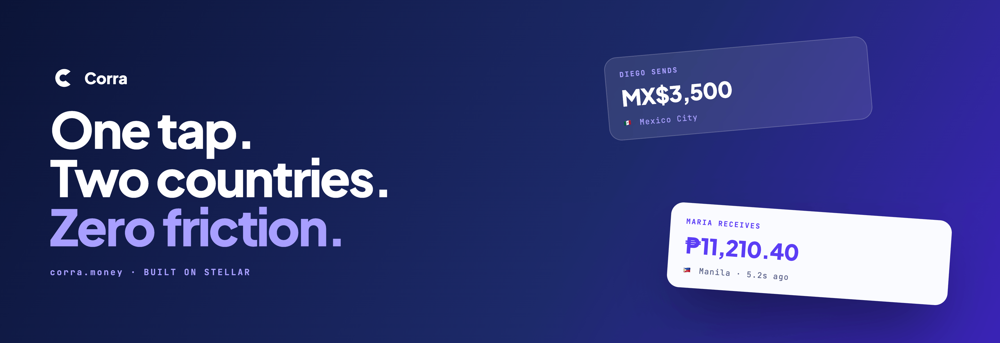
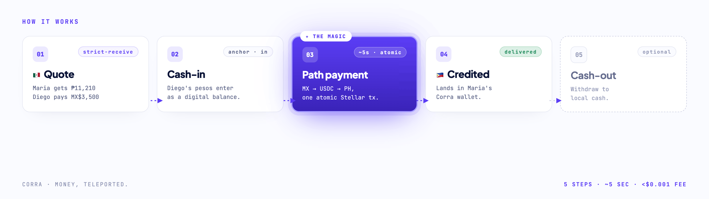

# Corra

### Money, teleported.

Corra is a cross-border remittance app on Stellar, powered by an open-source **anchor-aggregation layer**.
Send local cash in one country, your recipient gets local cash in another, and nobody ever sees the word "crypto."

---

## The problem

Cross-border money transfer still settles in 1-3 days and loses 5-7% to fees plus a hidden FX spread the sender never sees.

Stellar already has the rails to fix this: a single **path payment** atomically converts one currency to another through USDC on the open DEX at near-zero cost, and Stellar's own path-finding already picks the cheapest on-chain route.

What is missing sits one layer up: an **anchor aggregator** that normalizes fragmented fiat on/off-ramps behind a single adapter interface and routes each corridor to a usable ramp, while orchestrating cash-in -> USDC hub -> cash-out as one flow.

> **Liquidity on paper is not a usable ramp.** Most anchors that hold local liquidity expose no developer-integratable on/off-ramp. The path payment is a commodity. The orchestration layer that makes heterogeneous, not-ready anchors usable is the moat.

---

## How it works

A sender in Mexico wants to send money to Maria in the Philippines:

1. **Quote** -- "Maria gets PHP 11,210." Corra computes what the sender pays (a strict-receive quote, so the recipient amount is guaranteed).
2. **Cash-in** -- the sender's local currency enters as a digital balance via an anchor.
3. **Path payment (~5s, atomic)** -- `MXN -> USDC (hub) -> PHP`, settled on Stellar in one atomic transaction.
4. **Credited** -- the funds land in Maria's Corra wallet. A safe terminal state.
5. **Cash-out (optional)** -- Maria withdraws to local cash through an anchor.

Every step is verifiable on `stellar.expert` by a transaction hash. No engineering knowledge required to check it.
