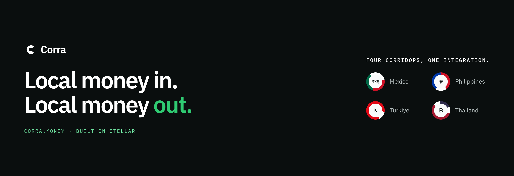
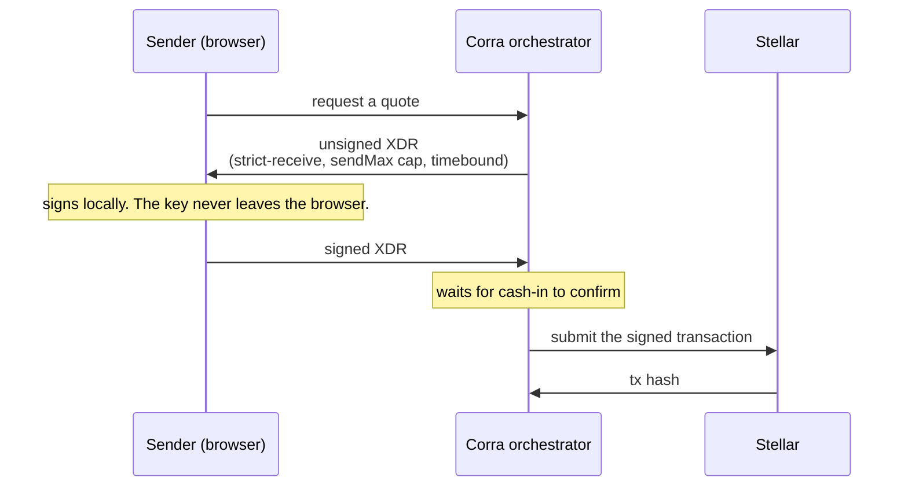
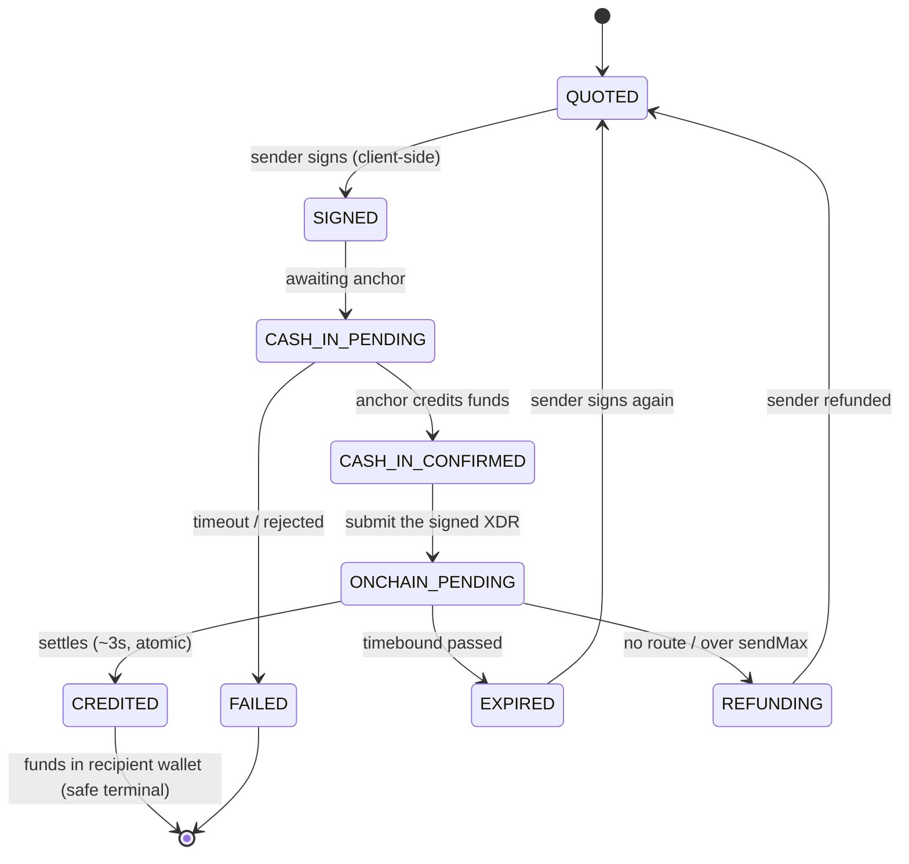

<div align="center">



<h1 align="center">
  <picture>
    <source media="(prefers-color-scheme: dark)" srcset="assets/wordmark-dark.svg" />
    
  </picture>
</h1>

### Money, teleported.

Corra is a **non-custodial cross-border remittance app on Stellar**.
Send local cash in one country, your recipient gets local cash in another, and nobody ever sees the word "crypto."

[](https://test.corra.money)
[](https://corra.money)
[](https://stellar.org)
[](https://www.typescriptlang.org)
[](LICENSE)

</div>

---

## See it work first

**[test.corra.money](https://test.corra.money)** runs a real Stellar testnet payment on every click. Not a mockup, not a recording:

```
MXN 3,499.99  ->  USDC  ->  PHP 11,210      settled in ~3s
```

Each run submits a live `path_payment_strict_receive` and gives you the transaction hash to check on `stellar.expert` yourself. The verify link only appears once *that* run has a hash, so you are never shown a canned transaction as proof.

**Corra's server never holds a private key.** It builds an unsigned transaction, your browser signs it, and the server only relays the signed XDR onward. Details in [Non-custodial by design](#non-custodial-by-design).

---

## The problem

Cross-border money transfer still settles in 1-3 days and loses 5-7% to fees plus a hidden FX spread the sender never sees.

Stellar already solves the settlement half. A single **strict-receive path payment** atomically converts one currency to another through USDC on the open DEX at near-zero cost, and Stellar's own path-finding picks the cheapest route. That part is a commodity, and we treat it as one.

What is missing sits either side of that leg:

**1. A remittance is asynchronous, but signing is not.** Cash-in confirms minutes after the sender has walked away from the kiosk. Every obvious design here reaches for custody, which is the wrong answer for users and impossible for a builder without a money transmission licence. There is no existing Stellar building block for *sign now, settle later, never hold the key*.

**2. A single path payment is not a payment.** No ledger, no idempotency, no refund when the source cost moves past the cap, no recovery when cash-in confirms but settlement was never submitted, no handling for a pre-signed transaction whose timebound expired.

Both are orchestration problems that sit *above* the SEP layer rather than duplicating it.

---

## What we don't build

Corra depends on the ecosystem's existing pieces and writes none of them. This is deliberate and worth being explicit about:

| Concern | What we use | Lines we write |
|---|---|---|
| SEP-1 / SEP-10 / SEP-12 / SEP-24 | [`@stellar/typescript-wallet-sdk`](https://github.com/stellar/typescript-wallet-sdk) (SDF) | none |
| Transactions, Horizon, path payments | [`@stellar/stellar-sdk`](https://github.com/stellar/js-stellar-sdk) (SDF) | none |
| Wallet connection and signing | [`@creit.tech/stellar-wallets-kit`](https://github.com/Creit-Tech/Stellar-Wallets-Kit) | none |
| FX routing | Stellar DEX path-finding | none |

We do not implement a SEP client, and we do not wrap the SEPs in a parallel abstraction of our own.

**On SEP-31:** it is an anchor-to-anchor protocol whose sending side requires a licensed entity and bilateral agreements with each counterparty. It is not something a consumer app can implement, and we don't claim to. SEP-24 is the wallet-side standard and is what we use.

**What is left for us to write** is the part no building block provides: the non-custodial signing flow, and the orchestration and ledger around it.

---

## Non-custodial by design

The obvious way to drive an asynchronous payment is to hold the user's key and sign when cash-in lands. Corra does not do that. Instead the transaction is **pre-signed**:


```mermaid
sequenceDiagram
    participant U as Sender (browser)
    participant O as Corra orchestrator
    participant H as Stellar

    U->>O: request a quote
    O->>U: unsigned XDR<br/>(strict-receive, sendMax cap, timebound)
    Note over U: signs locally. The key never leaves the browser.
    U->>O: signed XDR
    Note over O: waits for cash-in to confirm
    O->>H: submit the signed transaction
    H->>O: tx hash
```

The server has no signing capability at all. That is asserted by tests on every run, which read the endpoint sources and fail if signing code reappears.

This is not only a security posture, it is what makes the architecture legally coherent: the regulated legs (cash-in, cash-out, customer KYC) stay entirely with the licensed anchor, and Corra is an interface and an orchestrator that never touches user funds.

**It has costs, and we fund them rather than hide them:**

- A pre-signed transaction pins a sequence number, so the account cannot transact in between.
- The timebound can expire before cash-in confirms. That is a real failure branch: the transaction dies safely and the sender is asked to sign again, never left silently stuck.

---

## Payment lifecycle

Only the on-chain leg is atomic. The cash-in and cash-out legs are slow and external, so the flow is a saga with compensation built in.


```mermaid
stateDiagram-v2
    [*] --> QUOTED
    QUOTED --> SIGNED: sender signs (client-side)
    SIGNED --> CASH_IN_PENDING: awaiting anchor
    CASH_IN_PENDING --> CASH_IN_CONFIRMED: anchor credits funds
    CASH_IN_PENDING --> FAILED: timeout / rejected
    CASH_IN_CONFIRMED --> ONCHAIN_PENDING: submit the signed XDR
    ONCHAIN_PENDING --> CREDITED: settles (~3s, atomic)
    ONCHAIN_PENDING --> EXPIRED: timebound passed
    ONCHAIN_PENDING --> REFUNDING: no route / over sendMax
    EXPIRED --> QUOTED: sender signs again
    REFUNDING --> QUOTED: sender refunded
    CREDITED --> [*]: funds in recipient wallet (safe terminal)
    FAILED --> [*]
```

Design notes are published in [`/docs`](docs):

| Doc | What's inside |
|---|---|
| [Architecture](docs/architecture.md) | The layers and the boundaries between them. |
| [Flows](docs/flows.md) | The happy path and every failure branch as explicit saga sequences. |
| [Contracts](docs/contracts.md) | The TypeScript type boundaries. |
| [Ledger](docs/ledger.md) | The Postgres schema: saga state, payment legs, append-only event log. |
| [API](docs/api.md) | The `/quote` and `/confirm` HTTP surface. |
| [Testing](docs/testing.md) | How each leg and failure path is verified, end to end. |

---

## What this proves, and what it doesn't

The demo is honest about its own boundaries, and the page labels each step:

| Leg | Status |
|---|---|
| `MXN -> USDC -> PHP` path payment | **real**, on Stellar testnet, verifiable by hash |
| Client-side signing, keyless server | **real**, asserted by tests |
| Cash-in at the kiosk, cash-out in Manila | **simulated**, no anchor is integrated yet |
| DEX liquidity | **self-seeded** on testnet, not an open market |

The demo sender is a throwaway testnet account whose key ships to the browser on purpose, so anyone can click without installing a wallet. It carries a bounded balance and no real value.

**No real anchor is integrated yet.** Securing one is BD work, not engineering, and it depends on third parties saying yes. Until then this demonstrates a mechanism, not a live corridor.

---

## Anchor reality check

While mapping which Mexico and Philippines ramps could actually be integrated, we probed the ecosystem directly. `anchors.stellar.org` has no public API, so the directory was scraped and every home domain fetched:

| | |
|---|---|
| Anchor entries in the directory | 79 |
| Declaring no SEP support at all | 48 |
| Home domains probed | 330 |
| Declaring `TRANSFER_SERVER_SEP0024` | 42 |
| Whose SEP-24 endpoint actually responds | **19** |
| Distinct live operators behind those | **~12** |

**Roughly 55% of declared SEP-24 endpoints are dead.** Worse, 22 of the 42 declarations come from domains impersonating real financial institutions: `goldmansachs.com.co`, `bnymellon.com.co`, `pimco.dev` and others, carrying real company names and real CEO names in their `stellar.toml`, pointing at endpoints that do not exist.

This is why Corra scopes carefully. Liquidity on paper is not an integratable ramp, and a directory listing is not a working endpoint.

*Measured 2026-07-28. Numbers move; the method is reproducible.*

---

## Tech stack

| Layer | Choice |
|---|---|
| Language | TypeScript, end to end |
| Stellar | `@stellar/stellar-sdk`, `@stellar/typescript-wallet-sdk` |
| Signing | `@creit.tech/stellar-wallets-kit` (client-side only) |
| Orchestrator | Node.js + Fastify |
| Database | Postgres (saga state + append-only event log) |
| Frontend | React + Vite |

---

## Status

Testnet, in active development. No real money moves. Mainnet, real KYC and a licensed anchor relationship are explicitly future phases and depend on partners, not on code.

## Contact

Website: [corra.money](https://corra.money) · Twitter / X: [@corra_money](https://x.com/corra_money)

## License

[MIT](LICENSE).
