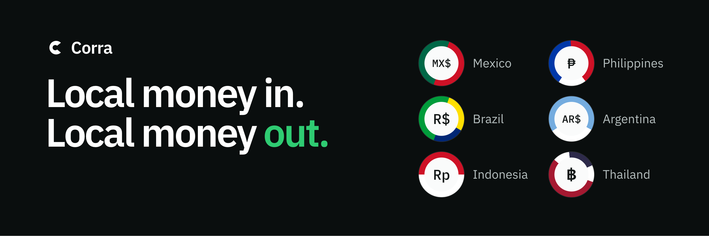
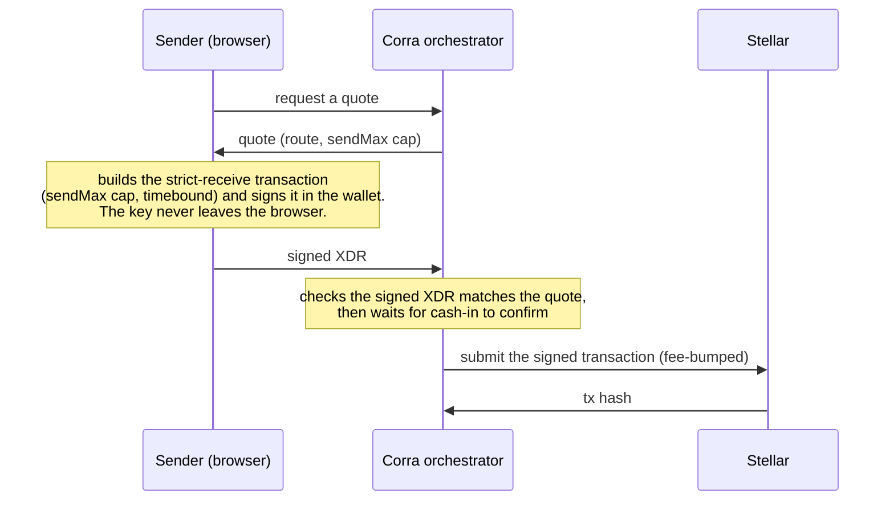
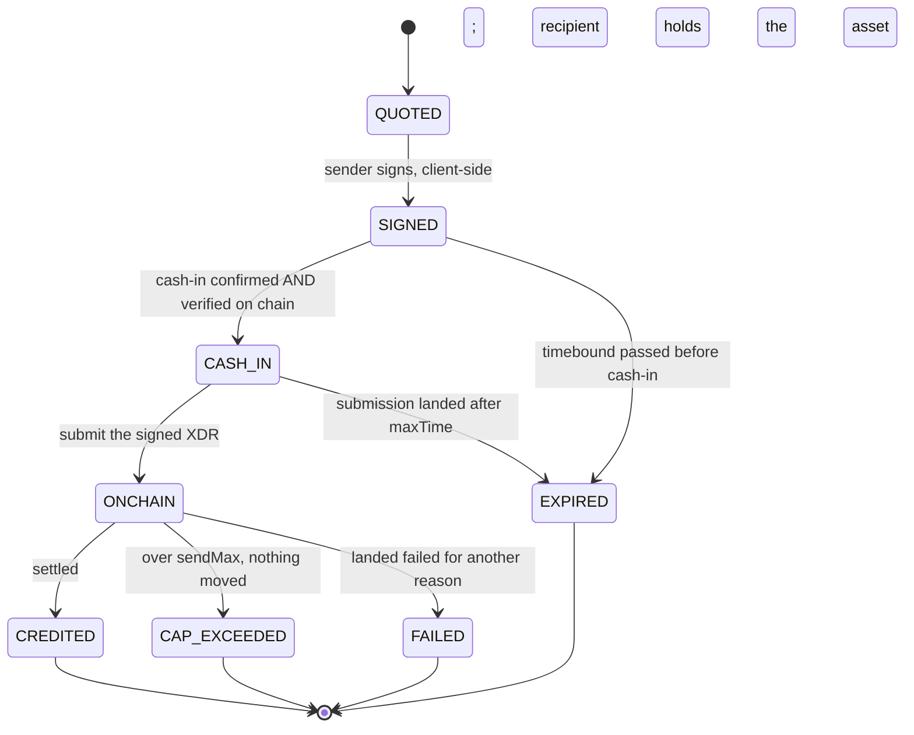

<div align="center">



### Money, teleported.

Corra is a **non-custodial cross-border remittance app on Stellar**.
Send local cash in one country, your recipient gets local cash in another, and nobody ever sees the word "crypto."

[](https://github.com/yigitcangokmen/corramoney/actions/workflows/ci.yml)
[](https://app.corra.money)
[](https://corra.money)
[](https://stellar.org)
[](https://www.typescriptlang.org)
[](LICENSE)

</div>

---

## Try the app

**[app.corra.money](https://app.corra.money)** -- fix what the recipient gets, sign once in Freighter, pay in pesos at the anchor, close the tab. Corra submits the payment you already signed once your cash-in lands on chain.

```
TESTMXN  ->  USDC  ->  TESTPHP      strict-receive, capped by the sendMax you signed
```

Five corridors from Mexico (Philippines, Brazil, Argentina, Indonesia, Thailand). Every step of every payment links to its transaction on stellar.expert.

Month 2 adds three things, all with a 0-XLM account and one wallet prompt each:

1. **Balance.** Add money once at the anchor into your own account (a deposit tied to no payment), then send to any corridor from that balance (**Balance** tab, then **Send** with "Pay from my balance").
2. **Pool.** Move TESTMXN into Corra's own Blend lending pool and take it back (the pool card on the **Balance** tab; On-Ice, 0% rate, borrowing off).
3. **Cash out.** The recipient withdraws the TESTPHP at the anchor (**Cash out** tab): one signed payment to the anchor, Corra pays the fee.

**Corra never holds a user's key.** Your wallet signs; the orchestrator holds only a fully bound signed transaction and can submit it or not. Details in [Non-custodial by design](#non-custodial-by-design). Proof index: [EVIDENCE.md](EVIDENCE.md) (month 2: [its generated block](EVIDENCE.md#month-2-balance-blend-pool-cash-out-second-sow)).

## Run it yourself

Node 22, pnpm 9, Docker.

```bash
pnpm install
docker compose up -d --wait postgres                       # the ledger
pnpm seed-testnet                                          # issuer, 6 corridor tokens + USDC, market-maker orderbooks, SACs
pnpm onchain-check                                         # Deliverable 1 mechanics on testnet, incl. cap-exceeded and expiry
pnpm exec tsx infra/anchor/setup.ts
docker compose -f infra/anchor/docker-compose.yml up -d --build   # SDF Anchor Platform + the anchor's business server
ANCHOR_HOME_DOMAIN=http://localhost:8080 pnpm --filter @corra/orchestrator start
pnpm drive-payment                                         # one payment through the API and the anchor to CREDITED
pnpm --filter @corra/web dev                               # the app, against your local orchestrator
```

For localhost testing, all of this in one command: `pnpm local:up` (see [docs/local.md](docs/local.md)). It also starts a local GoatCounter at http://stats.localhost:8094, so localhost user tests are counted; `pnpm local:check` proves the stack end to end and `pnpm ops-check` checks balances, channels, the anchor, the pool and the keys from outside.

The same commands run in CI: [`quickstart.yml`](.github/workflows/quickstart.yml) from a clean clone, and [`ci.yml`](.github/workflows/ci.yml) with the `no-server-side-signing` job.

| Path | What it is |
|---|---|
| `apps/web` | The sender app. Builds and signs in the browser; SEP-10 and SEP-24 through the wallet SDK. |
| `services/orchestrator` | `/quote`, `/confirm`, saga, submit-on-confirm, reconciler, Postgres ledger. |
| `packages/settlement-saga` | The extractable saga another Stellar wallet can lift ([README](packages/settlement-saga/README.md)). |
| `packages/stellar` | Strict-receive construction, bound-transaction check, sponsor key scope, Horizon gateway. |
| `packages/shared` | Money (bigint, never floats), assets, corridors, wire format. |
| `services/anchor-business`, `infra/anchor` | The test anchor's side: Anchor Platform config and its business server. Not Corra. |

---

## The problem

Cross-border money transfer still settles in 1-3 days and is expensive: the World Bank puts the global average cost of sending $200 at 6.49% in Q1 2025, against a UN Sustainable Development Goal target of 3%, plus an FX spread the sender never sees.

Stellar already solves the settlement half. A single **strict-receive path payment** atomically converts one currency to another through USDC on the open DEX at near-zero cost, and Stellar's own path-finding picks the cheapest route. That part is a commodity, and we treat it as one.

What is missing sits either side of that leg:

**1. A remittance is asynchronous, but signing is not.** Cash-in confirms minutes after the sender has walked away from the kiosk. Every obvious design here reaches for custody, which is the wrong answer for users and impossible for a builder without a money transmission licence. There is no existing Stellar building block for *sign now, settle later, never hold the key*.

**2. A single path payment is not a payment.** No ledger, no idempotency, no refund when the source cost moves past the cap, no recovery when cash-in confirms but settlement was never submitted, no handling for a pre-signed transaction whose timebound expired.

Both are orchestration problems that sit *above* the SEP layer rather than duplicating it.

---

## What we don't build

Corra depends on the ecosystem's existing pieces and writes none of them. This is deliberate and worth being explicit about:

| Concern | What we use | Lines we write |
|---|---|---|
| SEP-1 / SEP-10 / SEP-24 / SEP-38 | [`@stellar/typescript-wallet-sdk`](https://github.com/stellar/typescript-wallet-sdk) (SDF) | none |
| Transactions, Horizon, path payments | [`@stellar/stellar-sdk`](https://github.com/stellar/js-stellar-sdk) (SDF) | none |
| Wallet connection and signing | Freighter (now named Varial) via [`@stellar/freighter-api`](https://github.com/stellar/freighter) | none |
| FX routing | Stellar DEX path-finding | none |

We do not implement a SEP client, and we do not wrap the SEPs in a parallel abstraction of our own.

**On SEP-31:** it is an anchor-to-anchor protocol whose sending side requires a licensed entity and bilateral agreements with each counterparty. It is not something a consumer app can implement, and we don't claim to. SEP-24 is the wallet-side standard and is what we use.

**What is left for us to write** is the part no building block provides: the non-custodial signing flow, and the orchestration and ledger around it.

---

## Non-custodial by design

The obvious way to drive an asynchronous payment is to hold the user's key and sign when cash-in lands. Corra does not do that. Instead the transaction is **pre-signed**:


```mermaid
sequenceDiagram
    participant U as Sender (browser)
    participant O as Corra orchestrator
    participant H as Stellar

    U->>O: request a quote
    O->>U: quote (route, sendMax cap)
    Note over U: builds the strict-receive transaction<br/>(sendMax cap, timebound) and signs it in the wallet.<br/>The key never leaves the browser.
    U->>O: signed XDR
    Note over O: checks the signed XDR matches the quote,<br/>then waits for cash-in to confirm
    O->>H: submit the signed transaction (fee-bumped)
    H->>O: tx hash
```

The browser builds the strict-receive transaction itself ([`apps/web/src/logic/remit.ts`](apps/web/src/logic/remit.ts), `buildStrictReceive`). The orchestrator never builds the payment: it checks that the signed XDR matches the quote (`assertBoundPayment` in [`packages/stellar/src/validate.ts`](packages/stellar/src/validate.ts)) and refuses it otherwise.

Corra signs nothing with a user's key, and that is the invariant worth stating precisely rather than as a false absolute. **The server holds keys of its own: the fee-and-sponsor key, the client_domain key, and five channel accounts that only source sponsored setups creating an account (fee and sequence only; no reserve, no value, never a signer). None can sign for a user or move user value:**

- **The fee-and-sponsor account**, confined to [`packages/stellar/src/sponsor.ts`](packages/stellar/src/sponsor.ts). CAP-15 fee-bump requires the fee source to sign the envelope, and CAP-33 sponsorship requires the sponsor to sign the setup transaction that opens `BeginSponsoringFutureReserves`, so that signature is unavoidable if the sender is to need no XLM. It signs only fee-bump envelopes around one sender-signed path payment, or around one user-signed Blend pool submit that passes `assertPoolSubmit` (Corra's pool, from = spender = to = the signer, supply or withdraw of the pool asset only, fee and time bounded), plus sponsorship setup transactions of a fixed shape. It pays network fees and base reserves.
- **Corra's SEP-10 client_domain `SIGNING_KEY`**, in [`services/orchestrator/src/client-domain.ts`](services/orchestrator/src/client-domain.ts). It co-signs the anchor's SEP-10 login challenge so the anchor can attribute the session to Corra. A challenge has sequence 0 and can never be submitted.
- **Five channel accounts**, in [`packages/stellar/src/channels.ts`](packages/stellar/src/channels.ts). Each is only the transaction source of a sponsored setup that creates an account, leased to one sign-up at a time, so concurrent sign-ups do not share the sponsor's sequence number. A channel pays that setup's fee; the sponsor still pays every reserve.

Every server signature, and what bounds it:

| Path | Key | Can it move user value? | Bound by |
|---|---|---|---|
| Fee-bump of a pre-signed path payment | sponsor | No: user-signed, bound to the quote | `assertBoundPayment`; the fee-bump allowlist |
| Fee-bump of a payment from the balance | sponsor | No: same shape, user-signed | `assertBoundPayment` (balance), a chain balance check, one in flight per sender |
| Fee-bump of a pool `submit` | sponsor | No: from = spender = to = the signer, supply or withdraw only, Corra's pool and asset | `assertPoolSubmit`, a resource-fee cap, a global limit |
| Fee-bump of a recipient's withdrawal payment | sponsor | No: user-signed payment of exactly the leg amount to the disclosed distribution account | `assertCashOutPayment`, destination and asset pinned |
| Sponsorship setup (sponsor or channel as source) | sponsor | No: begin, create a 0-XLM account, the user's trustlines, end | `assertSetupShape`, a fixed trust scope |
| Channel signature on a setup | channel | No: only the fee and sequence of a setup that creates an account | `assertSetupShape`, the lease, CI |
| SEP-10 client_domain co-signature | client_domain | No: a sequence-0 challenge | unchanged |

Every payment and pool transaction has the sender's **payment account** as its transaction source: a 0-XLM account the sponsor sets up once, whose only signer is the sender (master weight 0). The sender is the operation source and signs; the payment account just carries the sequence number. Why: wallets warn when the signer is also the fee source of a 0-XLM transaction ([risks](docs/risks.md) R18).

The CI job that enforces this is named **`no-server-side-signing`** ([`scripts/no-server-side-signing.ts`](scripts/no-server-side-signing.ts)), and it prints the exact scope it asserts so the name can never be read as broader than the check. It parses every non-test module under `services/orchestrator/src`, `packages/stellar/src`, `packages/settlement-saga/src` and `packages/shared/src`, and fails the build if:

- a `Keypair` is loaded (`fromSecret`, `fromRawEd25519Seed`, `random`, `master`, `new Keypair`, `StrKey.decodeEd25519SecretSeed`) or a signing call (`sign`, `signTransaction` and similar) is made outside `sponsor.ts`, `client-domain.ts` and `channels.ts`, or a raw signing primitive (`sign` and key generation from `node:crypto`, `tweetnacl`, `@noble/*` and similar) is imported anywhere
- a string literal in that code is seed-shaped (`S[A-Z2-7]{55}`)
- the fee-sponsor secret is referenced anywhere except `config.ts` and `index.ts`, or `index.ts` uses it for anything but `createSponsor()`; the same for the channel secrets and `createChannels()`
- `sponsor.ts` has other than 2 signing call sites, `client-domain.ts` or `channels.ts` other than 1, or any of them other than 1 key load

The same job then runs the scanner on a fixture that loads and signs with a key, and fails unless the scanner catches both lines. Finally it runs the `@corra/stellar` unit tests, which check that the sponsor key refuses a fee-bump or setup outside its scope. The scanner is a static check of the source. It does not inspect responses or logs at runtime, and the refusals to touch value are asserted by those unit tests, not by the scanner.

A job that asserted "no signing anywhere" would be asserting something the protocol makes impossible, and would have to be either disabled or quietly narrowed the first time sponsorship was wired up.

This is not only a security posture, it is what makes the architecture legally coherent: the regulated legs (cash-in, cash-out, customer KYC) stay entirely with the licensed anchor, and Corra is an interface and an orchestrator that never touches user funds.

**It has costs, and we fund them rather than hide them:**

- A pre-signed transaction pins a sequence number, so the account cannot transact in between.
- The timebound can expire before cash-in confirms. That is a real failure branch: the transaction dies safely and the sender is asked to sign again, never left silently stuck.

**Analytics.** The app counts usage with a self-hosted, cookie-less GoatCounter (stats.corra.money): one page view per visit and three named events, `wallet-connect`, `quote` and `sign`. Each hit sends the path (`/` or the event name), the page title, the query string, the screen width and a referrer: the browser's referrer for the page view, the participant tag from the visit's link (`?utm_source=U3`) or nothing for an event. Never an address, an amount, a hash, an id or an error text ([risks](docs/risks.md) R25).

**Testnet resets.** SDF resets Stellar testnet from time to time (next: 2026-12-16 17:00 UTC). Every evidence transaction is archived as raw JSON in the repo before that, and `pnpm redeploy-after-reset` rebuilds the testnet side with the same keys, so the addresses stay the same ([docs/testnet-reset.md](docs/testnet-reset.md)).

---

## Payment lifecycle

Only the on-chain leg is atomic. The cash-in and cash-out legs are slow and external, so the flow is a saga with compensation built in.


```mermaid
stateDiagram-v2
    [*] --> QUOTED
    QUOTED --> SIGNED: sender signs, client-side
    SIGNED --> CASH_IN: cash-in confirmed AND verified on chain
    SIGNED --> EXPIRED: timebound passed before cash-in
    CASH_IN --> ONCHAIN: submit the signed XDR
    CASH_IN --> EXPIRED: submission landed after maxTime
    ONCHAIN --> CREDITED: settled; recipient holds the asset
    ONCHAIN --> CAP_EXCEEDED: over sendMax, nothing moved
    ONCHAIN --> FAILED: landed failed for another reason
    CREDITED --> [*]
    EXPIRED --> [*]
    CAP_EXCEEDED --> [*]
    FAILED --> [*]
```

`EXPIRED` leaves from `SIGNED` or `CASH_IN`, never from `ONCHAIN`: a transaction whose timebound passed never enters a ledger at all. `CASH_IN` is never entered on the anchor callback alone, the deposit is independently confirmed from chain state first. And the terminal exits do not loop back, re-signing opens a **new** saga that references the old one by id, so the ledger keeps one row per signed transaction.

The cash-out is not a payment state. A `CREDITED` payment carries a `cash_out` leg that is `PENDING` until the recipient withdraws the asset at the anchor (SEP-24, the **Cash out** tab): the recipient signs one payment to the anchor's distribution account, Corra fee-bumps it, and the leg is `CONFIRMED` only when the anchor's signed `completed` callback and the chain agree on that payment.

Design notes are published in [`/docs`](docs):

| Doc | What's inside |
|---|---|
| [Architecture](docs/architecture.md) | The layers and the boundaries between them. |
| [Flows](docs/flows.md) | The happy path and every failure branch as explicit saga sequences. |
| [Contracts](docs/contracts.md) | The TypeScript type boundaries. |
| [Ledger](docs/ledger.md) | The Postgres schema: saga state, payment legs, append-only event log. |
| [API](docs/api.md) | The `/quote` and `/confirm` HTTP surface. |
| [Testing](docs/testing.md) | How each leg and failure path is verified, end to end. |
| [Risks](docs/risks.md) | Every risk carried into v1, what it costs, and what bounds it. |
| [Demo](docs/demo.md) | What a reviewer sees, in order, and what each step proves. |
| [Local stack](docs/local.md) | The whole stack on localhost against testnet, in one command. |
| [Testnet reset](docs/testnet-reset.md) | How the testnet side is rebuilt after an SDF reset, with the same addresses. |
| [Release checklist](docs/release-checklist.md) | What has to pass before anything reaches production. |

---

## What this proves, and what it doesn't

The demo is honest about its own boundaries, and the page labels each step:

| Leg | Status |
|---|---|
| `MXN -> USDC -> PHP` path payment | **real**, on Stellar testnet, verifiable by hash |
| Client-side signing, no user key on the server | **real**, asserted by the `no-server-side-signing` job and unit tests |
| Cash-in | **real protocol, our anchor**: SEP-10, SEP-24 and SEP-38 against a self-hosted SDF Anchor Platform at `anchor.corra.money`; the SPEI transfer behind it is simulated |
| Cash-out in Manila | **real protocol, our anchor**: a SEP-24 TESTPHP withdrawal at the test anchor, signed by the recipient and fee-bumped by Corra; the cash pickup behind it is simulated, no fiat moves |
| DEX liquidity | **self-seeded** on testnet, not an open market |

The sender signs in their own Freighter wallet; no key that can sign for the sender or hold value is generated or shipped to the browser; setup creates a throwaway key for the 0-XLM payment account, the same transaction sets that key to weight 0, and the key is never stored. To send without setting up a second wallet, the app offers a public demo recipient account (`demoRecipient` in [`packages/shared/src/testnet.ts`](packages/shared/src/testnet.ts), created by `pnpm demo-recipient`). It holds a trustline for every destination asset and its secret was discarded, so it only ever receives.

**No third-party anchor is integrated yet.** Securing one is BD work, not engineering, and it depends on third parties saying yes. Until then this demonstrates a mechanism, not a live corridor.

---

## Anchor reality check

While mapping which Mexico and Philippines ramps could actually be integrated, we probed the ecosystem directly. `anchors.stellar.org` has no public API, so the directory was scraped and every home domain fetched:

| | |
|---|---|
| Anchor entries in the directory | 79 |
| Declaring no SEP support at all | 48 |
| Home domains probed | 330 |
| Declaring `TRANSFER_SERVER_SEP0024` | 42 |
| Whose SEP-24 endpoint actually responds | **19** |
| Distinct live operators behind those | **~12** |

**Roughly 55% of declared SEP-24 endpoints are dead.** Worse, 22 of the 42 declarations come from domains impersonating real financial institutions: `goldmansachs.com.co`, `bnymellon.com.co`, `pimco.dev` and others, carrying real company names and real CEO names in their `stellar.toml`, pointing at endpoints that do not exist.

This is why Corra scopes carefully. Liquidity on paper is not an integratable ramp, and a directory listing is not a working endpoint.

*Measured 2026-07-28. Numbers move; the method is reproducible.*

---

## Tech stack

| Layer | Choice |
|---|---|
| Language | TypeScript, end to end |
| Stellar | `@stellar/stellar-sdk`, `@stellar/typescript-wallet-sdk` |
| Signing | Freighter via `@stellar/freighter-api` (client-side only) |
| Orchestrator | Node.js + Fastify |
| Database | Postgres (saga state + append-only event log) |
| Frontend | React + Vite |

---

## Status

Testnet, in active development. No real money moves. Month 1 (asynchronous non-custodial settlement, orchestrator and ledger, demo) is delivered; month 2 (balance and send-from-balance, Corra's Blend pool, the recipient's SEP-24 cash-out and channel accounts) is built and its evidence is in [EVIDENCE.md](EVIDENCE.md). Mainnet, real KYC and a licensed anchor relationship are explicitly future phases and depend on partners, not on code ([risks](docs/risks.md) R23).

## Contact

Website: [corra.money](https://corra.money) · Twitter / X: [@corra_money](https://x.com/corra_money)

## License

[MIT](LICENSE).
