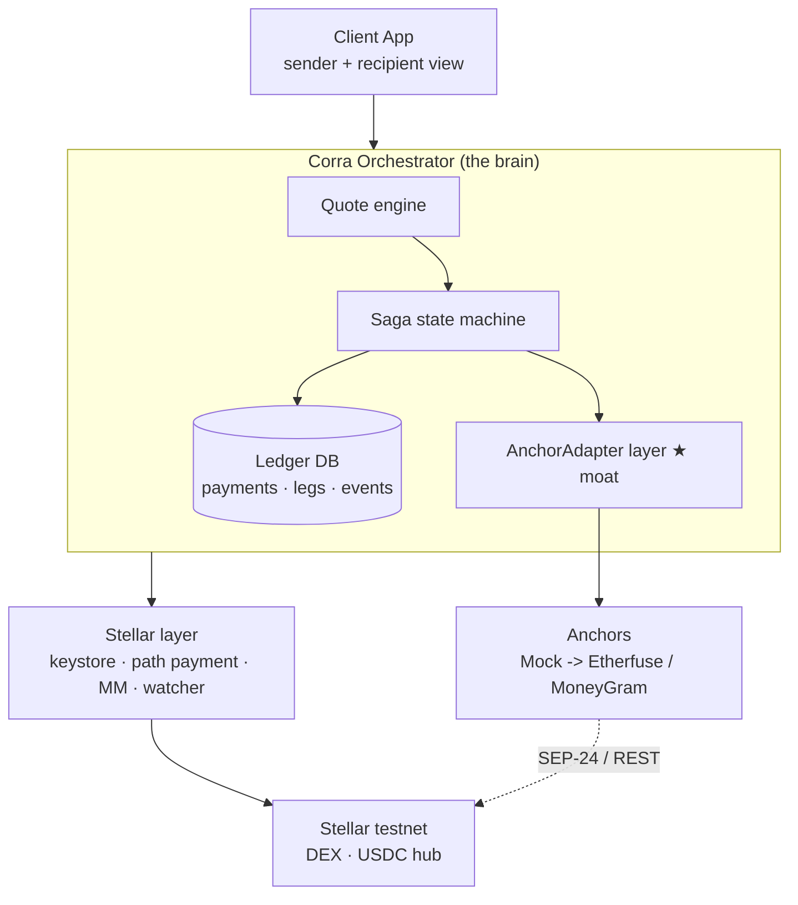
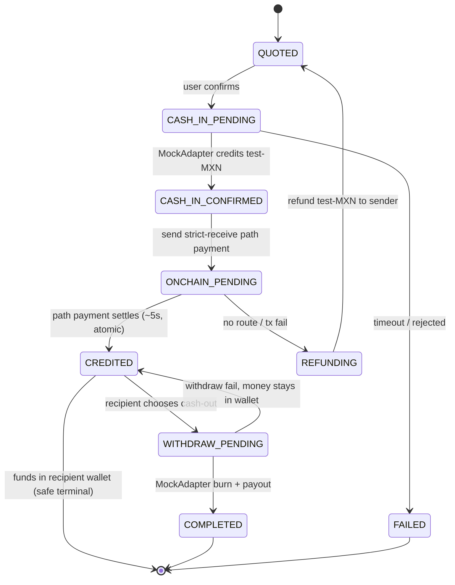
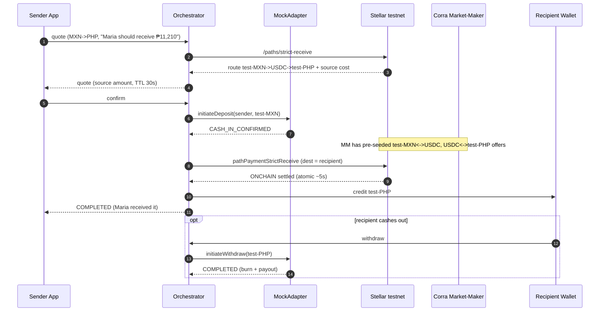

# Corra: Architecture

## 0. Locked-in decisions

| Decision | Choice | Outcome |
|---|---|---|
| **Custody** | Thin custodial, **testnet** | Corra holds the testnet keys (custodial wallet). The real custody/licensing question is deferred and abstracted behind a keystore, so a later move to non-custodial is possible. |
| **Recipient** | **Corra wallet** | Funds land in the recipient's Corra account; they hold the balance or withdraw it later. Cash-out is a separate/optional leg, which reduces saga risk. |
| **Demo** | **Pure testnet mock** | testanchor.stellar.org plus our own seeded DEX liquidity. Requires no permissions or anchor approval. |

**Design principle:** The moat is not path payment (that is a commodity). The moat is the **Anchor Adapter layer** (which normalizes heterogeneous anchors) plus the **orchestration saga** (which safely manages the three legs). Build the architecture around these two, so that replacing mocks with real anchors is just a matter of adding a new adapter.

---

## 1. Layers

```
[ Client / App ]   sender + recipient view · no use of the word "crypto" · Corra API only
        │
[ Corra Orchestrator ]   THE BRAIN
   ├─ Quote engine        FX + DEX strict-receive path estimation
   ├─ Saga state machine  transitions between legs + compensation/refund
   ├─ Anchor Adapter layer ★ MOAT  normalizes the cash-in/cash-out gateways
   ├─ Ledger (DB)         the single source of truth for payment state + timeline
   └─ Webhook/poll ingest normalizes anchor events
        │
[ Stellar layer ]   account/trustline · path payment · claimable balance
   │                USDC hub · market-maker seeding · Horizon watcher · custodial keystore
[ Anchor network ]  testanchor (mock) -> later Etherfuse/MoneyGram (behind the adapter)
[ Stellar testnet ] DEX/liquidity · USDC issuer
```

**Golden rule:** The app never sees keys or the chain; it only talks to the Corra API. The only place that touches Stellar is the `stellar` layer. The only place that touches anchors is the adapters. The core (saga + ledger) is unaware of both and knows only their interfaces.

---

## 2. Anchor Adapter: the concrete form of the moat

A single internal interface; every anchor (and mock) sits behind it. The core does not know which anchor it is talking to.

```ts
interface AnchorAdapter {
  id: string
  capabilities(): { onramp: boolean; offramp: boolean; assets: AssetId[]; corridors: Corridor[]; kyc: 'none'|'anchor'|'corra' }
  getQuote(req: QuoteReq): Promise<Quote>                 // firm/indicative
  initiateDeposit(req): Promise<{ ref: string; interactiveUrl?: string; instructions?: any }>   // cash-in
  initiateWithdraw(req): Promise<{ ref: string; payoutDetails: any }>                            // cash-out
  status(ref: string): Promise<LegStatus>                 // PENDING|CONFIRMED|FAILED
  parseEvent(payload): NormalizedEvent                    // webhook/poll -> single event type
}
```

Concrete implementations (in priority order):
- **`MockAdapter`**: testnet demo. On cash-in it credits test-MXN, on cash-out it burns. The Corra market-maker provides the liquidity. *This is what we are building now.*
- `Sep24Adapter`: testanchor.stellar.org (SEP-10 + SEP-24). The standard path; MoneyGram will later fit here too.
- `Sep31Adapter`: Bitso-style (SEP-31 + SEP-38).
- `EtherfuseRampAdapter`: custom REST + claimable-balance onramp (not the classic SEP-24).

> A new anchor means a new adapter file. The saga, ledger, and app never change. **This is exactly where the aggregator value lies.**

---

## 3. Flow (sender wallet -> recipient Corra wallet)

```
1. QUOTED              strict-receive: "Maria should receive ₱11,210" -> compute what the sender pays
2. CASH_IN (mock)      MockAdapter credits test-MXN to the sender's account
3. ONCHAIN  (~5s)      strict-receive path payment:
                       test-MXN -> USDC(hub) -> test-PHP  -> lands in the RECIPIENT's Corra account  [ATOMIC]
4. CREDITED            funds are in the recipient's wallet: a safe terminal state
5. WITHDRAW (optional) if the recipient wants, cash out via MockAdapter (a separate async leg)
```

**Why this order is safe:** The only atomic point is leg 3 (the path payment). Because the funds rest in the recipient's own account at step 4, even if cash-out (5) fails the money is not lost; it simply waits in the wallet. The recipient-wallet decision is what simplifies the saga here.

**Compensation:**
- Path payment fails after cash-in -> refund the sender's test-MXN, fall back to QUOTED.
- Path payment partial fill risk -> use **strict-receive** (the amount the recipient gets is fixed; the source side varies, protected by a max-send limit).
- Withdraw fails -> no-op, the money stays in the wallet, retry.

---

## 4. Stellar layer: concrete testnet details

- **Custodial keystore:** Corra generates/stores a testnet keypair for each user. For now it is simple (an encrypted store), but it sits behind a `KeyStore` interface, so a later move to non-custodial/KMS is a single implementation change.
- **Account setup:** fund via friendbot, open trustlines with **sponsored reserves**, so the user never holds XLM. Each account gets a trustline for the assets it will hold (test-MXN, test-PHP, USDC).
- **USDC hub + market-maker:** a Corra-controlled hub plus a market-maker account **seeds** test-MXN<->USDC and USDC<->test-PHP offers on the DEX. Without this, the path payment cannot find liquidity to match against: a mandatory architectural piece for the demo.
- **Path payment:** `pathPaymentStrictReceive`. The route is found via `/paths/strict-receive`. Quote expiry + slippage buffer (max-send).
- **Monitoring & reconciliation:** every payment carries an idempotency id; the Horizon transaction result is watched; a **poll fallback** guards against lost webhooks. The Ledger (DB) is the source of truth; Stellar is settlement.

---

## 5. Proposed repository layout (the real product repo, later)

A monorepo (pnpm + turbo recommended), end-to-end **TypeScript**, `@stellar/stellar-sdk`:

```
apps/web                 sender + recipient view (landing already exists)
services/orchestrator    API + saga + quote + ledger (Node/Fastify)
packages/anchor-adapters ★ interface + MockAdapter + Sep24Adapter …
packages/stellar         account/trustline/path-payment/keystore/MM/watcher
packages/shared          types, Money, Quote, Corridor, AssetId
```
DB: Postgres (saga state + timeline). Because this layout **isolates the core from anchors and from the chain**, the mock-to-real transition is a minimal diff.

---

## 6. Not built now but with a slot reserved (deferred)

| Deferred | How it slots in |
|---|---|
| Real anchors (Etherfuse/MoneyGram) | A new `AnchorAdapter` implementation |
| Non-custodial keys | A new implementation of the `KeyStore` interface |
| Real KYC/compliance | `kyc: 'anchor'` + SEP-12/SEP-24 webview |
| Mainnet custody / licensing | A custody decision + money-transmitter analysis |
| Travel rule (SEP-31) | sender/receiver data inside Sep31Adapter |

---

## 7. Assumptions (correct if wrong)

- End-to-end TypeScript, `@stellar/stellar-sdk`, orchestrator on Node/Fastify, app on React/Vite, DB on Postgres.
- Monorepo (pnpm/turbo).
- In the PoC, both sender and recipient have a Corra (custodial) account.

## 8. Sub-decisions (resolved)

| Question | Decision | Rationale |
|---|---|---|
| **App framework** | **React + Vite (SPA)** | Compatible with the existing tooling (the site is already Vite+TS); for a custodial testnet PoC, SSR/server-routing is unnecessary. The orchestrator is a separate Fastify service, so the app stays a pure client. No need for the complexity Next would bring. |
| **Quote: firm vs indicative** | **Indicative + 30s TTL**, the recipient side **guaranteed via strict-receive** | A firm quote requires a SEP-38/anchor commitment, which the mock does not have. The amount the recipient gets (₱) is fixed via strict-receive; volatility falls on the source side. The slippage buffer is **1.5% max-send** on top. Re-quote if the TTL expires. |
| **Is recipient withdraw included in the PoC** | **Yes but minimal**: the climax is CREDITED, withdraw is an optional button | Step 5 of the landing is "cash out", so keep a mock withdraw leg to show the full lifecycle, but the peak of the demo is the money landing in the recipient's wallet (CREDITED). Withdraw is complementary, not the focus. |
| **Ledger schema** | **`payments` + `legs` + append-only `payment_events`** (not full event-sourcing) | A pragmatic middle ground: state lives in `payments`/`legs`, while the timeline UI (the 5-step diagram) is fed from the `payment_events` log. Full event-sourcing is overkill for a PoC. |
| **Market-maker seed** | **Fixed offers** (seeded at startup), with wide depth around the pegged rate | A dynamic MM is unnecessary complexity. A `seed-liquidity` script sets up test-MXN<->USDC and USDC<->test-PHP offers; enough depth for the whole demo. Re-seeding is manual. |

## 9. Diagrams

### 9.1 Layers & moat (component)



### 9.2 Saga state machine



### 9.3 End-to-end flow (sequence)


