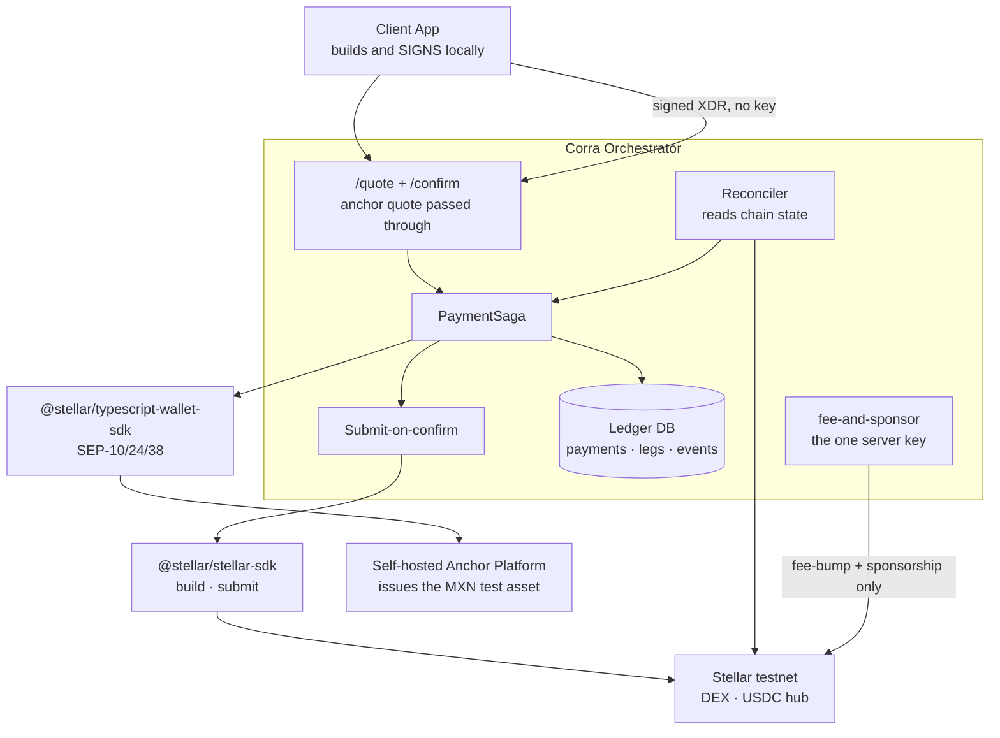
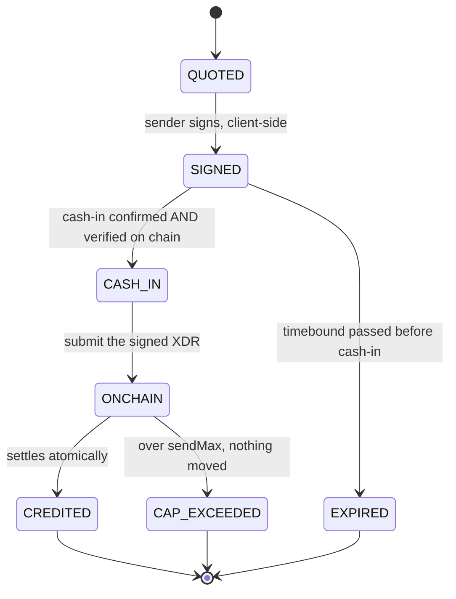
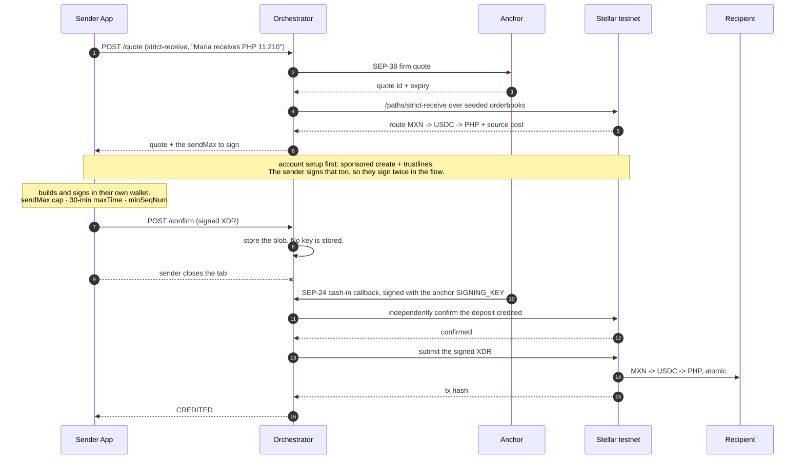

# Corra: Architecture

## 0. Locked-in decisions

| Decision | Choice | Outcome |
|---|---|---|
| **User keys** | **None, anywhere.** | The sender signs the payment in their own wallet. No user key is generated, stored, escrowed or recovered by anything Corra runs. |
| **Server keys** | **Exactly one: the fee-and-sponsor account.** | CAP-15 fee-bump requires the fee source to sign, and CAP-33 requires the sponsor to sign `BeginSponsoringFutureReserves`. That signature is unavoidable if the sender is to need no XLM. It signs nothing else and can move no user value. |
| **Recipient** | **Their own Stellar account** | Funds land in an account only the recipient can sign for. `CREDITED` is a safe terminal state. |
| **Cash-in** | **A self-hosted SDF Anchor Platform** | It issues the MXN test asset. No third-party anchor can credit a token minted by our own testnet issuer, so this is structural, not a preference. `testanchor.stellar.org` is kept as a conformance check. |
| **Pricing** | **SEP-38 integration is real; the instance is ours** | No testnet anchor quotes MXN or PHP, so the corridor rate comes from orderbooks our market-maker seeds. v1 demonstrates routing and ordering, not price discovery. |

**Design principle:** the path payment is a commodity and we treat it as one. What we build is the part no existing building block provides: driving an *asynchronous* payment without holding a user's key, and the ledger and failure handling around it.

---

## 1. Layers

```
[ Client / App ]   sender + recipient view · builds and signs locally · never says "crypto"
        │
[ Corra Orchestrator ]
   ├─ /quote + /confirm   passes the anchor's SEP-38 quote through unchanged
   ├─ PaymentSaga         QUOTED · SIGNED · CASH_IN · ONCHAIN · CREDITED
   ├─ Submit-on-confirm   submits the already-signed XDR once cash-in is verified on chain
   ├─ Reconciler          rebuilds saga state from the chain; creates no new state
   └─ Ledger (Postgres)   payments · legs · append-only events
        │
[ Stellar layer ]   sponsored trustlines · strict-receive path payment · market-maker · Horizon
[ Anchor ]          self-hosted Anchor Platform (SEP-10/24/38 via the wallet SDK)
[ Stellar testnet ] DEX liquidity · USDC hub
```

**There is no quote engine in this diagram, and that is deliberate.** `/quote` asks the anchor's SEP-38 quote server and carries its `id` and `expiry` through untouched; the corridor leg comes from the SDK's path-finding. We do not compute a rate, and we do not invent a quote format.

**There is no keystore either.** The one key the orchestrator holds is the fee-and-sponsor account, kept in the deployment's secret store, and its use is bounded to two operation types.

---

## 2. Anchor integration: what we depend on, what we write

We do not define an abstraction over the SEPs. SEP-1, SEP-10, SEP-12, SEP-24 and SEP-38 are consumed through SDF's [`@stellar/typescript-wallet-sdk`](https://github.com/stellar/typescript-wallet-sdk) as a declared dependency, and we write no SEP client code.

```ts
import { Wallet } from '@stellar/typescript-wallet-sdk'

const anchor  = wallet.anchor({ homeDomain: ANCHOR_HOME_DOMAIN })
const auth    = await anchor.sep10()
const deposit = await anchor.sep24().deposit({ ... })
```

Swapping anchors is changing `homeDomain`. That is the SDK's design, not something we add. **There is no `AnchorAdapter`-shaped interface here**, and writing one before a second anchor exists would be inventing a seam to fit a future we have not met.

**Which anchor, and why it is ours.** The primary cash-in path is SDF's Anchor Platform reference deployment, run in Docker and configured to issue the MXN test asset. `testanchor.stellar.org` cannot serve this corridor: it deposits only the assets it supports, and no third-party anchor will ever credit a token minted by our own issuer. It is still used once, as a conformance check that our SEP-10, SEP-24 and callback-signature code works against an implementation we did not write.

The honest consequence: because we run that instance, the cash-in confirmation and the SEP-38 quote behind it are ours. What this demonstrates is the protocol integration and the ordering, not an independent counterparty.

**On SEP-31:** the spec requires both sides to be licensed anchors with bilateral agreements. A consumer app is not a sending anchor. Out of scope, and the wallet SDK does not implement it either.

---

## 3. Flow (sender to recipient)

```
1. QUOTED    strict-receive: "Maria should receive PHP 11,210" -> what the sender pays
2. SIGNED    the sender signs the path payment in their own wallet
             (sendMax cap · 30-minute maxTime · minSeqNum). The signed XDR goes to
             the orchestrator. The key does not.
3. CASH_IN   the anchor reports the deposit AND it is confirmed from chain state.
             Minutes may pass; the sender has left.
4. ONCHAIN   the orchestrator submits the already-signed transaction:
             MXN -> USDC(hub) -> PHP, into the RECIPIENT's account   [ATOMIC]
5. CREDITED  funds are in the recipient's own account: safe terminal state
```

There is no withdraw step in v1. The cash-out leg is a mock payout handler, so `CREDITED` means the recipient's testnet account holds the destination asset and the handler acknowledged, not that anyone received money.

**Why the order is safe:** the only atomic point is step 4, and funds rest in an account only the recipient can sign for at step 5.

**Failure branches, and what each actually costs:**

- **Source cost moves past `sendMax`** -> the operation fails with `op_over_sendmax` and the transaction lands in a ledger as failed. Nothing moves. The sender still holds the deposited asset in their own account, so **no refund leg runs**. The fee and the sequence number are consumed, so the signed blob is spent and a retry is a new saga.
- **The 30-minute timebound expires before cash-in confirms** -> the transaction never enters a ledger at all. The saga is `EXPIRED` and the sender is asked to sign again. Never silently stuck.
- **The cash-in callback is lost** -> the reconciler reads the deposit from chain state and advances the saga. A lost callback costs a delay, not a stuck payment.

Re-signing never revives a terminal saga. It opens a new one whose `supersedes_id` points at the old, so the ledger keeps one row per signed transaction.

---

## 4. Stellar layer: concrete testnet details

- **No user key, one server key.** The orchestrator never calls `Keypair.fromSecret` on a user's key and never signs for a user. The fee-and-sponsor account signs fee-bump envelopes and `BeginSponsoringFutureReserves`, nothing else, and never appears as a source or destination in a `payment` or `path_payment_*`.
- **Pre-signed transaction:** `pathPaymentStrictReceive` with a `sendMax` cap and a 30-minute `maxTime`, signed client-side and held as an XDR until cash-in is confirmed. Two costs are accepted and handled: it pins a sequence number, and it can expire.
- **`minSeqNum` (CAP-21)** keeps the pre-signed transaction valid across a sequence range instead of one exact value. It widens the window; it does not remove it. If the sender's account transacts past that range during the wait, the transaction is permanently dead and routes to the re-sign path.
- **Account setup:** friendbot funding, trustlines opened under **sponsored reserves** so the user needs no XLM. Sponsorship is a sandwich, and the sponsored account must authorise the closing half, so the sender signs twice in the flow: once for setup, once for the payment.
- **USDC hub + market-maker:** a market-maker account seeds MXN/USDC and USDC/PHP offers on the testnet DEX. Without it the path payment has nothing to match against. A testnet setup step, not a product feature, and the reason the corridor rate is ours.
- **Path payment:** route found via `/paths/strict-receive`. The recipient amount is fixed by strict-receive; volatility falls on the source side, bounded by `sendMax`.
- **Reconciliation:** every payment carries an idempotency id. The reconciler runs over this instance's own pending payments only, reads the authoritative fact from Horizon, and advances the saga to match. **The chain outranks the ledger.** Retrying submission is safe because Stellar consumes the sequence number on the first successful submission and rejects every later resubmission of the same blob.

---

## 5. Proposed repository layout

A monorepo (pnpm + turbo), end-to-end **TypeScript**:

```
apps/web                 sender + recipient view; builds and signs locally
services/orchestrator    /quote + /confirm, saga, submit-on-confirm, reconciler, ledger
packages/settlement-saga the extractable module another wallet can lift
packages/anchors         wallet-SDK usage and the SEP-24 callback verifier
packages/stellar         trustlines, path-payment construction, market-maker, Horizon reads
packages/shared          types: Money, Quote, Corridor, AssetId
```

DB: Postgres (saga state + timeline).

---

## 6. Deferred, with a slot reserved

| Deferred | How it slots in |
|---|---|
| A real anchor | wallet SDK `homeDomain` for SEP-24 anchors; a thin client only for a non-SEP ramp |
| Real KYC/compliance | SEP-12 through the wallet SDK, driven by the anchor |
| A real payout leg | Replaces the mock cash-out handler. Needs a licensed partner, not more code |
| Mainnet | Requires that partner relationship |
| A re-sign notification path | What would let a slow cash-in rail work at all. See the limits below |

Passkey and Soroban smart-wallet signing is **not** a drop-in: a contract address cannot be the source account of a classic `pathPaymentStrictReceive`. Moving there would mean moving FX off the classic DEX, which is a different architecture.

---

## 7. Limits carried into v1

- **The 30-minute window bounds this to fast cash-in.** The design assumes cash-in confirms inside the signature window, which holds for instant rails and for a local anchor instance. Slower rails such as a bank transfer or an OXXO cash deposit exceed it and fall to the re-sign path. Widening the window without weakening the cap is Phase 2 work and is not solved here.
- **The orchestrator can decline to submit.** That is indistinguishable from expiry and costs the sender nothing, since funds never left their account. The signed XDR is also returned to the sender's browser, so they can submit it to any Horizon themselves. Because the inner transaction relies on Corra's fee-bump, doing so requires their own XLM or their own fee-bump wrapper, so the escape hatch is real but not free.
- **The public demo currently ships a throwaway key.** It generates a testnet account server-side and sends the secret to the browser so a reviewer can click without installing a wallet. That is a custodial shortcut, it is disclosed, and Week 1 removes it.

---

## 8. Sub-decisions (resolved)

| Question | Decision | Rationale |
|---|---|---|
| **App framework** | **React + Vite (SPA)** | Signing happens in the client, so it must be a real client and not an SSR surface. The orchestrator is a separate Fastify service. |
| **Quote** | **SEP-38 firm quote from the anchor, passed through unchanged** | We add only the saga identifier and the `sendMax` the sender signs. The corridor leg comes from path-finding over seeded orderbooks, and that is stated wherever the claim is made. |
| **Signing timing** | **Sign before cash-in, submit after** | A remittance is asynchronous: cash-in confirms after the sender has left. Signing up front is what removes the need for custody. |
| **Timebound length** | **30 minutes** | Long enough for an instant rail and a local anchor, short enough that a stale signed transaction cannot linger. A slow rail needs a re-sign notification path, which is Phase 2. |
| **Ledger schema** | **`payments` + `legs` + append-only `payment_events`** | State lives in `payments`/`legs`; the timeline is fed from the event log. Full event-sourcing is overkill. |
| **Market-maker seed** | **Fixed offers**, wide depth around the pegged rate | A dynamic MM is unnecessary complexity. Re-seeding is manual. |

## 9. Diagrams

### 9.1 Components


```mermaid
flowchart TB
    App["Client App<br/>builds and SIGNS locally"]
    subgraph Core["Corra Orchestrator"]
        API["/quote + /confirm<br/>anchor quote passed through"]
        SAGA["PaymentSaga"]
        SUB["Submit-on-confirm"]
        REC["Reconciler<br/>reads chain state"]
        LED[("Ledger DB<br/>payments · legs · events")]
        FEE["fee-and-sponsor<br/>the one server key"]
    end
    SDK["@stellar/typescript-wallet-sdk<br/>SEP-10/24/38"]
    STL["@stellar/stellar-sdk<br/>build · submit"]
    ANC["Self-hosted Anchor Platform<br/>issues the MXN test asset"]
    NET["Stellar testnet<br/>DEX · USDC hub"]

    App --> API
    API --> SAGA
    SAGA --> LED
    SAGA --> SUB
    REC --> SAGA
    App -- "signed XDR, no key" --> API
    SAGA --> SDK
    SDK --> ANC
    SUB --> STL
    STL --> NET
    REC --> NET
    FEE -- "fee-bump + sponsorship only" --> NET
```

### 9.2 Saga state machine


```mermaid
stateDiagram-v2
    [*] --> QUOTED
    QUOTED --> SIGNED: sender signs, client-side
    SIGNED --> CASH_IN: cash-in confirmed AND verified on chain
    SIGNED --> EXPIRED: timebound passed before cash-in
    CASH_IN --> ONCHAIN: submit the signed XDR
    ONCHAIN --> CREDITED: settles atomically
    ONCHAIN --> CAP_EXCEEDED: over sendMax, nothing moved
    CREDITED --> [*]
    EXPIRED --> [*]
    CAP_EXCEEDED --> [*]
```

`EXPIRED` leaves from `SIGNED`, not from `ONCHAIN`: a transaction whose timebound passed never enters a ledger at all, so there is no on-chain state to leave from. `CASH_IN` is never entered on the anchor callback alone; the deposit is independently confirmed from chain state first. The two terminal exits do not loop back. Re-signing opens a **new** saga referencing the old one by id, so the ledger keeps one row per signed transaction. There is no withdraw state in v1: the cash-out leg is a mock payout handler.

### 9.3 End-to-end flow (sequence)


```mermaid
sequenceDiagram
    autonumber
    participant S as Sender App
    participant O as Orchestrator
    participant A as Anchor
    participant X as Stellar testnet
    participant R as Recipient

    S->>O: POST /quote (strict-receive, "Maria receives PHP 11,210")
    O->>A: SEP-38 firm quote
    A-->>O: quote id + expiry
    O->>X: /paths/strict-receive over seeded orderbooks
    X-->>O: route MXN -> USDC -> PHP + source cost
    O-->>S: quote + the sendMax to sign

    Note over S,X: account setup first: sponsored create + trustlines.<br/>The sender signs that too, so they sign twice in the flow.

    Note over S: builds and signs in their own wallet.<br/>sendMax cap · 30-min maxTime · minSeqNum
    S->>O: POST /confirm (signed XDR)
    O->>O: store the blob. No key is stored.

    S--xO: sender closes the tab

    A->>O: SEP-24 cash-in callback, signed with the anchor SIGNING_KEY
    O->>X: independently confirm the deposit credited
    X-->>O: confirmed
    O->>X: submit the signed XDR
    X->>R: MXN -> USDC -> PHP, atomic
    X-->>O: tx hash
    O-->>S: CREDITED
```
