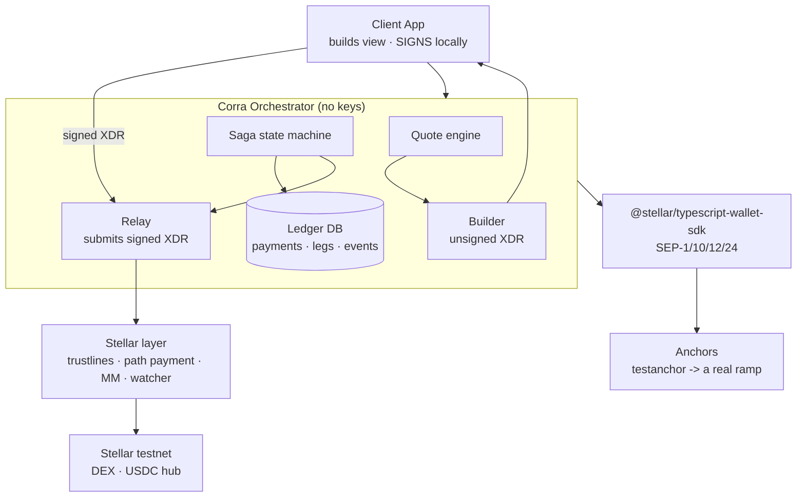
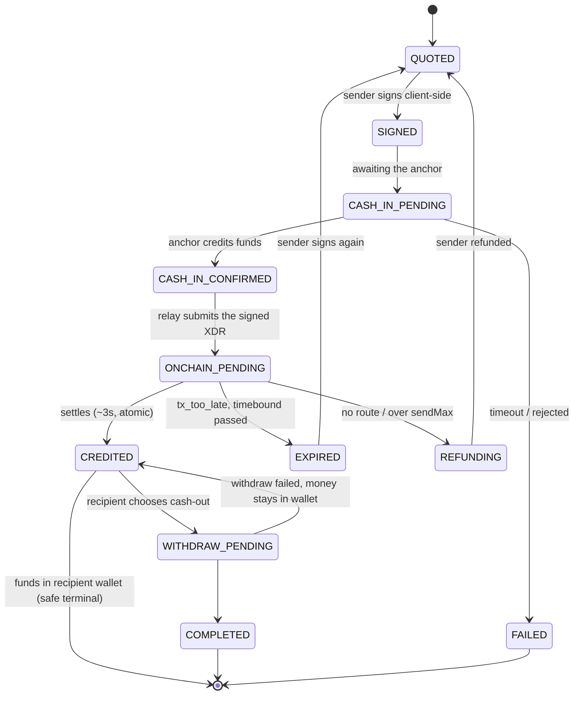
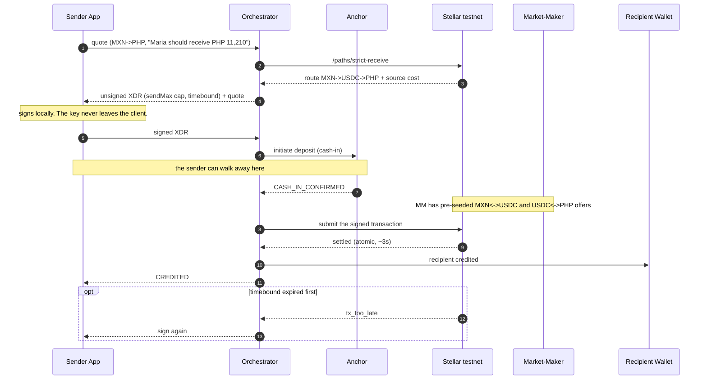

# Corra: Architecture

## 0. Locked-in decisions

| Decision | Choice | Outcome |
|---|---|---|
| **Custody** | **None. The server holds no private key.** | The sender signs the payment client-side; the orchestrator only builds the unsigned transaction and relays the signed one. This is enforced by tests that read the endpoint sources and fail if signing code reappears. |
| **Recipient** | **Corra wallet** | Funds land in the recipient's own account; they hold the balance or withdraw later. Cash-out is a separate optional leg, which reduces saga risk. |
| **Demo** | **Testnet, self-seeded liquidity** | testanchor.stellar.org plus our own seeded DEX offers. Requires no anchor permission. |

**Design principle:** the path payment is a commodity and we treat it as one. What we build is the part no existing building block provides: driving an *asynchronous* payment without ever holding a key, and the ledger and failure handling around it.

---

## 1. Layers

```
[ Client / App ]   sender + recipient view · signs locally · never says "crypto"
        │
[ Corra Orchestrator ]
   ├─ Quote engine        FX + DEX strict-receive path estimation
   ├─ Builder             constructs the UNSIGNED transaction (sendMax + timebound)
   ├─ Saga state machine  transitions between legs + compensation/refund
   ├─ Relay               submits the signed XDR once cash-in confirms
   ├─ Ledger (DB)         single source of truth for payment state + timeline
   └─ Event ingest        normalizes anchor webhooks/polls
        │
[ Stellar layer ]   trustlines (sponsored) · path payment · market-maker · Horizon watcher
[ Anchor network ]  testanchor (SEP-24 via the wallet SDK) -> later a real ramp
[ Stellar testnet ] DEX liquidity · USDC hub
```

**Golden rule:** the orchestrator can build and relay, but it cannot sign. There is no keystore in this diagram, by design.

---

## 2. Anchor integration: what we depend on, what we write

We do not define an abstraction over the SEPs. SEP-1, SEP-10, SEP-12 and SEP-24 are consumed through SDF's [`@stellar/typescript-wallet-sdk`](https://github.com/stellar/typescript-wallet-sdk) as a declared dependency, and we write no SEP client code.

```ts
import { Wallet } from '@stellar/typescript-wallet-sdk'

const anchor = wallet.anchor({ homeDomain: 'testanchor.stellar.org' })
const auth   = await anchor.sep10()
const kyc    = await anchor.sep12(token)
const deposit = await anchor.sep24().deposit({ ... })
```

Swapping anchors is changing `homeDomain`. That is the SDK's design, not something we add.

**The one case that needs code from us** is a ramp that implements no SEP at all. Etherfuse, the only Mexico ramp with a working developer sandbox, exposes a proprietary REST API with no `TRANSFER_SERVER_SEP0024`. The wallet SDK has no plugin point for that: its `Anchor`, `Sep24` and `Sep6` classes are concrete and hardwired to TOML endpoint shapes, and the only injection points are a custom Axios instance and the signer interfaces. So a non-SEP ramp has to be a sibling module, not a registered plugin.

If and when that is needed, it is a thin client for one named anchor, sitting beside the SDK rather than wrapping it.

**On SEP-31:** the spec requires both the sending and receiving side to be licensed anchors with bilateral agreements in place. A consumer app is not a sending anchor. It is out of scope here, and the wallet SDK does not implement it either.

---

## 3. Flow (sender -> recipient Corra wallet)

```
1. QUOTED     strict-receive: "Maria should receive PHP 11,210" -> compute what the sender pays
2. SIGNED     the sender signs the path payment locally (sendMax cap + timebound).
              The signed XDR goes to the orchestrator. The key does not.
3. CASH_IN    the anchor credits the sender's account. Minutes may pass; the sender can leave.
4. ONCHAIN    the orchestrator submits the already-signed transaction:
              MXN -> USDC(hub) -> PHP, into the RECIPIENT's account   [ATOMIC, ~3s]
5. CREDITED   funds are in the recipient's wallet: a safe terminal state
6. WITHDRAW   optional cash-out through an anchor (a separate async leg)
```

**Why the order is safe:** the only atomic point is step 4. Because funds rest in the recipient's own account at step 5, a failed cash-out does not lose money; it waits in the wallet.

**Compensation:**
- Source cost moves past `sendMax` -> the payment fails rather than silently costing more; the sender is refunded and falls back to QUOTED.
- The timebound expires before cash-in confirms -> the signed transaction is dead. The sender is asked to sign again. Never silently stuck.
- Withdraw fails -> no-op, the money stays in the wallet, retry.

---

## 4. Stellar layer: concrete testnet details

- **No keystore.** The orchestrator builds with `TransactionBuilder` and submits with `submitTransaction`. It never calls `Keypair.fromSecret`, and never calls `.sign()`.
- **Pre-signed transaction:** `pathPaymentStrictReceive` with a `sendMax` cap and a timebound, signed client-side and held as an XDR until cash-in confirms. Two costs are accepted and handled explicitly: it pins a sequence number, and it can expire.
- **Account setup:** fund via friendbot, open trustlines with **sponsored reserves** so the user never has to hold XLM.
- **USDC hub + market-maker:** a market-maker account seeds MXN<->USDC and USDC<->PHP offers on the testnet DEX. Without it the path payment has nothing to match against. This is a testnet setup step, not a product feature.
- **Path payment:** route found via `/paths/strict-receive`. Quote TTL plus a slippage buffer expressed as `sendMax`.
- **Monitoring & reconciliation:** every payment carries an idempotency id; the Horizon result is watched; a poll fallback guards against lost webhooks. The ledger is the source of truth; Stellar is settlement.

---

## 5. Proposed repository layout

A monorepo (pnpm + turbo), end-to-end **TypeScript**:

```
apps/web                 sender + recipient view; builds and signs locally
services/orchestrator    API + saga + quote + builder + relay + ledger (Node/Fastify)
packages/anchors         wallet-SDK usage; a thin client only for a non-SEP ramp
packages/stellar         trustlines, path-payment construction, market-maker, watcher
packages/shared          types: Money, Quote, Corridor, AssetId
```

DB: Postgres (saga state + timeline).

---

## 6. Deferred, with a slot reserved

| Deferred | How it slots in |
|---|---|
| A real anchor (Etherfuse / MoneyGram) | wallet SDK `homeDomain` for SEP-24 anchors; a thin client for a non-SEP ramp |
| Real KYC/compliance | SEP-12 through the wallet SDK, driven by the anchor |
| Mainnet | Requires a licensed anchor relationship, not more code |
| Hardware / passkey signing | A different client-side signer. The server is unaffected because it cannot sign either way. |

Note that passkey and Soroban smart-wallet signing is **not** a drop-in here: a contract address cannot be the source account of a classic `pathPaymentStrictReceive`. Moving there would mean moving FX off the classic DEX, which is a different architecture.

---

## 7. Assumptions

- End-to-end TypeScript; `@stellar/stellar-sdk` and `@stellar/typescript-wallet-sdk`; orchestrator on Node/Fastify; app on React/Vite; Postgres.
- Monorepo (pnpm/turbo).
- The sender controls their own key. In the public demo that key is a throwaway testnet account shipped to the browser on purpose, so anyone can click without installing a wallet; a real deployment swaps in a wallet signer with no server-side change.

## 8. Sub-decisions (resolved)

| Question | Decision | Rationale |
|---|---|---|
| **App framework** | **React + Vite (SPA)** | Matches the existing tooling. The orchestrator is a separate Fastify service, so the app stays a pure client. Signing happens here, which is another reason it must be a real client and not an SSR surface. |
| **Quote: firm vs indicative** | **Indicative + 30s TTL**, recipient side **guaranteed via strict-receive** | A firm quote needs a SEP-38 anchor commitment we do not have. The recipient amount is fixed; volatility falls on the source side, bounded by `sendMax`. |
| **Signing timing** | **Sign before cash-in, submit after** | A remittance is asynchronous: cash-in confirms after the sender has left. Signing up front is what removes the need for custody. The cost is a pinned sequence number and an expiry branch, both handled. |
| **Timebound length** | **180s in the demo; tunable per corridor** | Long enough for a testnet cash-in simulation, short enough that a stale signed transaction cannot linger. A real cash-in leg needs a longer window and a re-sign prompt. |
| **Ledger schema** | **`payments` + `legs` + append-only `payment_events`** | State lives in `payments`/`legs`; the timeline UI is fed from the event log. Full event-sourcing is overkill. |
| **Market-maker seed** | **Fixed offers**, wide depth around the pegged rate | A dynamic MM is unnecessary complexity. Re-seeding is manual. |

## 9. Diagrams

### 9.1 Components


```mermaid
flowchart TB
    App["Client App<br/>builds view · SIGNS locally"]
    subgraph Core["Corra Orchestrator (no keys)"]
        Q["Quote engine"]
        B["Builder<br/>unsigned XDR"]
        SAGA["Saga state machine"]
        REL["Relay<br/>submits signed XDR"]
        LED[("Ledger DB<br/>payments · legs · events")]
    end
    SDK["@stellar/typescript-wallet-sdk<br/>SEP-1/10/12/24"]
    STL["Stellar layer<br/>trustlines · path payment · MM · watcher"]
    ANC["Anchors<br/>testanchor -> a real ramp"]
    NET["Stellar testnet<br/>DEX · USDC hub"]

    App --> Core
    Q --> B
    B --> App
    App -- "signed XDR" --> REL
    SAGA --> LED
    SAGA --> REL
    Core --> SDK
    SDK --> ANC
    REL --> STL
    STL --> NET
```

### 9.2 Saga state machine


```mermaid
stateDiagram-v2
    [*] --> QUOTED
    QUOTED --> SIGNED: sender signs client-side
    SIGNED --> CASH_IN_PENDING: awaiting the anchor
    CASH_IN_PENDING --> CASH_IN_CONFIRMED: anchor credits funds
    CASH_IN_PENDING --> FAILED: timeout / rejected
    CASH_IN_CONFIRMED --> ONCHAIN_PENDING: relay submits the signed XDR
    ONCHAIN_PENDING --> CREDITED: settles (~3s, atomic)
    ONCHAIN_PENDING --> EXPIRED: tx_too_late, timebound passed
    ONCHAIN_PENDING --> REFUNDING: no route / over sendMax
    EXPIRED --> QUOTED: sender signs again
    REFUNDING --> QUOTED: sender refunded
    CREDITED --> [*]: funds in recipient wallet (safe terminal)
    CREDITED --> WITHDRAW_PENDING: recipient chooses cash-out
    WITHDRAW_PENDING --> COMPLETED
    WITHDRAW_PENDING --> CREDITED: withdraw failed, money stays in wallet
    COMPLETED --> [*]
    FAILED --> [*]
```

### 9.3 End-to-end flow (sequence)


```mermaid
sequenceDiagram
    autonumber
    participant S as Sender App
    participant O as Orchestrator
    participant A as Anchor
    participant X as Stellar testnet
    participant MM as Market-Maker
    participant R as Recipient Wallet

    S->>O: quote (MXN->PHP, "Maria should receive PHP 11,210")
    O->>X: /paths/strict-receive
    X-->>O: route MXN->USDC->PHP + source cost
    O-->>S: unsigned XDR (sendMax cap, timebound) + quote
    Note over S: signs locally. The key never leaves the client.
    S->>O: signed XDR
    O->>A: initiate deposit (cash-in)
    Note over S,A: the sender can walk away here
    A-->>O: CASH_IN_CONFIRMED
    Note over MM,X: MM has pre-seeded MXN<->USDC and USDC<->PHP offers
    O->>X: submit the signed transaction
    X-->>O: settled (atomic, ~3s)
    O->>R: recipient credited
    O-->>S: CREDITED
    opt timebound expired first
        X-->>O: tx_too_late
        O-->>S: sign again
    end
```
