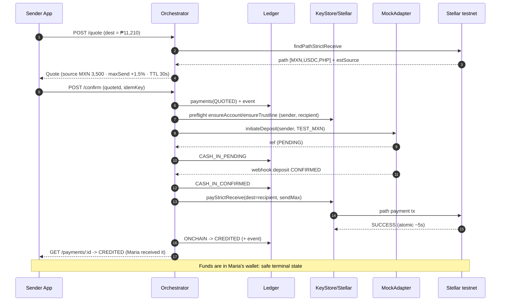
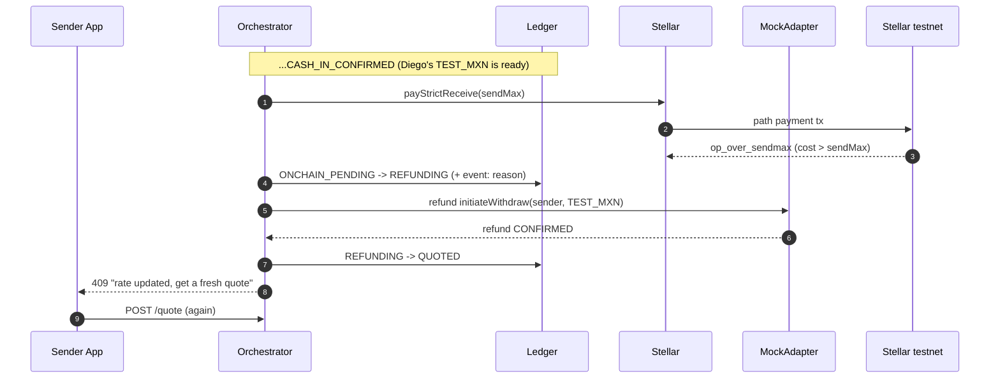
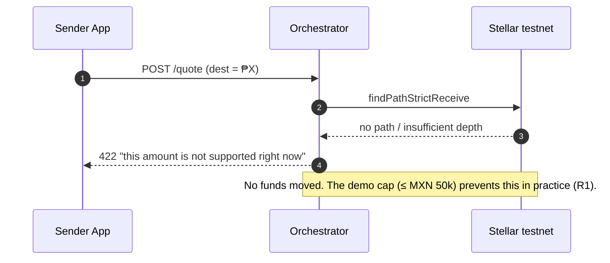
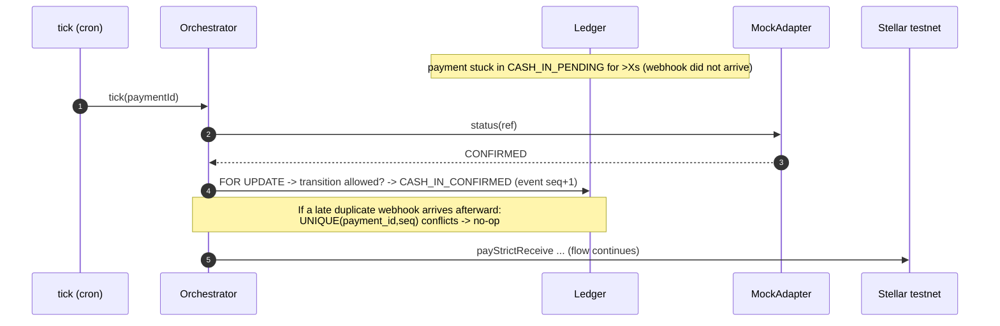

# Corra: Flows (happy + failure paths)

> Concrete sequences for the saga. There is one happy path; the failure paths are handled separately (no silent failures, every error transitions to a state). See also [contracts](contracts.md) and [ledger](ledger.md).

## 1. Happy path (Diego MX -> Maria PH)

## 2. Failure: over-sendmax (exchange rate moved)

After cash-in, the market moves; the actual source cost exceeds `sendMax` -> the tx is rejected -> **refund** -> re-quote. The sender's funds are not lost.

## 3. Failure: no route / insufficient liquidity

If market-maker depth is insufficient, no path is found. This error is caught at the quote stage **before confirm** -> cash-in never starts (the cleanest failure).

## 4. Failure: webhook loss -> reconcile (tick)

If the anchor webhook never arrives, the payment is stuck in PENDING. The `tick` job pulls the true status from Horizon/adapter and advances it. **At-least-once delivery, exactly-once effect.**

## Summary
- **Single atomic point:** the path payment (third leg). Everything before and after is saga.
- **Every failure transitions to a state:** over-sendmax -> REFUNDING -> QUOTED, no-path -> 422 at quote, webhook-loss -> tick reconcile.
- **Funds never evaporate:** either refunded to the sender, or in the recipient's wallet (CREDITED is the safe terminal state).
