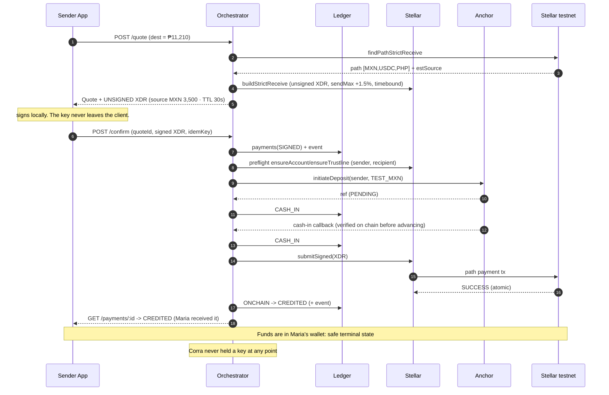
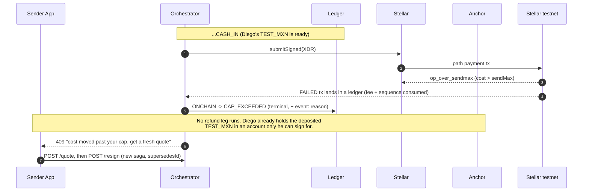
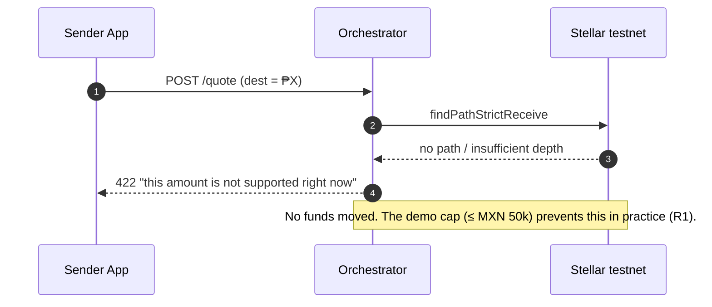
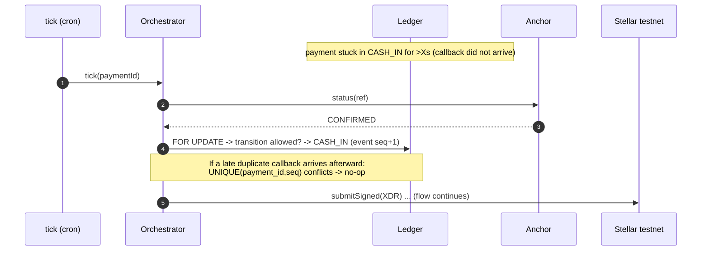
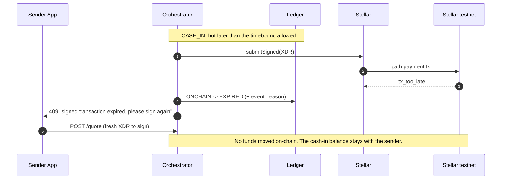

# Corra: Flows (happy + failure paths)

> Concrete sequences for the saga. There is one happy path; the failure paths are handled separately (no silent failures, every error transitions to a state). See also [contracts](contracts.md) and [ledger](ledger.md).

## 1. Happy path (Diego MX -> Maria PH)

```mermaid
sequenceDiagram
    autonumber
    participant S as Sender App
    participant O as Orchestrator
    participant L as Ledger
    participant K as Stellar
    participant A as Anchor
    participant X as Stellar testnet

    S->>O: POST /quote (dest = ₱11,210)
    O->>X: findPathStrictReceive
    X-->>O: path [MXN,USDC,PHP] + estSource
    O->>K: buildStrictReceive (unsigned XDR, sendMax +1.5%, timebound)
    O-->>S: Quote + UNSIGNED XDR (source MXN 3,500 · TTL 30s)
    Note over S: signs locally. The key never leaves the client.
    S->>O: POST /confirm (quoteId, signed XDR, idemKey)
    O->>L: payments(SIGNED) + event
    O->>K: preflight ensureAccount/ensureTrustline (sender, recipient)
    O->>A: initiateDeposit(sender, TEST_MXN)
    A-->>O: ref (PENDING)
    O->>L: CASH_IN
    A-->>O: cash-in callback (verified on chain before advancing)
    O->>L: CASH_IN
    O->>K: submitSigned(XDR)
    K->>X: path payment tx
    X-->>K: SUCCESS (atomic)
    O->>L: ONCHAIN -> CREDITED (+ event)
    O-->>S: GET /payments/:id -> CREDITED (Maria received it)
    Note over S,X: Funds are in Maria's wallet: safe terminal state
    Note over O: Corra never held a key at any point
```

## 2. Failure: over-sendmax (exchange rate moved)

After cash-in, the market moves and the actual source cost exceeds `sendMax`, so the operation fails on chain. **Nothing moves**: no path payment is applied and the sender keeps the deposited asset in an account only they can sign for. The fee and the sequence number are consumed, so the signed blob is spent and a retry is a new saga.

```mermaid
sequenceDiagram
    autonumber
    participant S as Sender App
    participant O as Orchestrator
    participant L as Ledger
    participant K as Stellar
    participant A as Anchor
    participant X as Stellar testnet

    Note over O,L: ...CASH_IN (Diego's TEST_MXN is ready)
    O->>K: submitSigned(XDR)
    K->>X: path payment tx
    X-->>K: op_over_sendmax (cost > sendMax)
    X-->>O: FAILED tx lands in a ledger (fee + sequence consumed)
    O->>L: ONCHAIN -> CAP_EXCEEDED (terminal, + event: reason)
    Note over S,A: No refund leg runs. Diego already holds the deposited<br/>TEST_MXN in an account only he can sign for.
    O-->>S: 409 "cost moved past your cap, get a fresh quote"
    S->>O: POST /quote, then POST /resign (new saga, supersedesId)
```

## 3. Failure: no route / insufficient liquidity

If market-maker depth is insufficient, no path is found. This error is caught at the quote stage **before confirm** -> cash-in never starts (the cleanest failure).

```mermaid
sequenceDiagram
    autonumber
    participant S as Sender App
    participant O as Orchestrator
    participant X as Stellar testnet

    S->>O: POST /quote (dest = ₱X)
    O->>X: findPathStrictReceive
    X-->>O: no path / insufficient depth
    O-->>S: 422 "this amount is not supported right now"
    Note over O,X: No funds moved. The demo cap (≤ MXN 50k) prevents this in practice (R1).
```

## 4. Failure: callback loss -> reconcile (tick)

If the anchor callback never arrives, the payment is stuck in PENDING. The reconciler pulls the authoritative fact from Horizon and from the SEP-24 transaction status, and advances the saga to match. Repeated delivery is harmless at the ledger level, and **exactly-once submission comes from the protocol**: Stellar consumes the sequence number on the first successful submission and rejects every later resubmission of the same blob.

```mermaid
sequenceDiagram
    autonumber
    participant T as tick (cron)
    participant O as Orchestrator
    participant L as Ledger
    participant A as Anchor
    participant X as Stellar testnet

    Note over L: payment stuck in CASH_IN for >Xs (callback did not arrive)
    T->>O: tick(paymentId)
    O->>A: status(ref)
    A-->>O: CONFIRMED
    O->>L: FOR UPDATE -> transition allowed? -> CASH_IN (event seq+1)
    Note over O,L: If a late duplicate callback arrives afterward:<br/>UNIQUE(payment_id,seq) conflicts -> no-op
    O->>X: submitSigned(XDR) ... (flow continues)
```

## 5. Failure: the signed transaction expired

Signing happens before cash-in, so a slow cash-in can outlive the timebound. The transaction dies safely and the sender re-signs. This is the cost of not holding a key, and it is funded rather than hidden.

```mermaid
sequenceDiagram
    autonumber
    participant S as Sender App
    participant O as Orchestrator
    participant L as Ledger
    participant K as Stellar
    participant X as Stellar testnet

    Note over O,L: ...CASH_IN, but later than the timebound allowed
    O->>K: submitSigned(XDR)
    K->>X: path payment tx
    X-->>K: tx_too_late
    O->>L: ONCHAIN -> EXPIRED (+ event: reason)
    O-->>S: 409 "signed transaction expired, please sign again"
    S->>O: POST /quote (fresh XDR to sign)
    Note over O,X: No funds moved on-chain. The cash-in balance stays with the sender.
```

## Summary
- **Single atomic point:** the path payment (third leg). Everything before and after is saga.
- **Every failure transitions to a state:** over-sendmax -> CAP_EXCEEDED (terminal, re-sign opens a new saga), no-path -> 422 at quote, callback-loss -> tick reconcile, expired timebound -> EXPIRED (terminal, re-sign opens a new saga).
- **Funds never evaporate:** either still in the sender's own account (nothing moved, so nothing needs refunding), or in the recipient's wallet (`CREDITED` is the safe terminal state).
