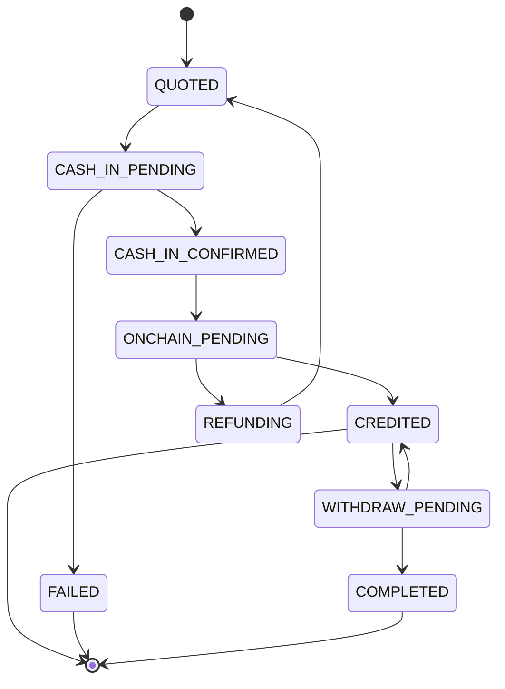

# Corra: Ledger (schema and state transition rules)

> The ledger is the **single source of truth** for payment status. Stellar is the settlement layer, the database is the timeline. Postgres.

## 1. Tables

```sql
-- One payment = one saga. idempotency_key UNIQUE means the same request cannot create two payments.
CREATE TABLE payments (
  id                TEXT PRIMARY KEY,             -- pmt_...
  public_id         TEXT NOT NULL UNIQUE,         -- short id shown to the user
  idempotency_key   TEXT NOT NULL UNIQUE,         -- idempotency key of the confirm() call
  sender_account    TEXT NOT NULL,
  recipient_account TEXT NOT NULL,
  corridor_from     TEXT NOT NULL,                -- "MX/MXN"
  corridor_to       TEXT NOT NULL,                -- "PH/PHP"
  quote             JSONB NOT NULL,               -- frozen Quote snapshot
  source_raw        NUMERIC(40,0) NOT NULL,       -- minor unit (bigint)
  dest_raw          NUMERIC(40,0) NOT NULL,
  state             TEXT NOT NULL,                -- PaymentState
  created_at        TIMESTAMPTZ NOT NULL DEFAULT now(),
  updated_at        TIMESTAMPTZ NOT NULL DEFAULT now()
);

-- Legs: cash_in / onchain / cash_out. external_ref is the adapter side; idempotent dedupe.
CREATE TABLE legs (
  id            TEXT PRIMARY KEY,                 -- leg_...
  payment_id    TEXT NOT NULL REFERENCES payments(id),
  kind          TEXT NOT NULL,                    -- cash_in | onchain | cash_out
  adapter_id    TEXT,                             -- mock | moneygram | etherfuse
  external_ref  TEXT,                             -- anchor leg reference
  tx_hash       TEXT,                             -- for the onchain leg
  amount_raw    NUMERIC(40,0) NOT NULL,
  asset_code    TEXT NOT NULL,
  asset_issuer  TEXT,
  status        TEXT NOT NULL DEFAULT 'PENDING',  -- LegStatus
  created_at    TIMESTAMPTZ NOT NULL DEFAULT now(),
  updated_at    TIMESTAMPTZ NOT NULL DEFAULT now(),
  UNIQUE (payment_id, kind),                      -- one of each leg per payment
  UNIQUE (adapter_id, external_ref)               -- the same anchor event is not processed twice
);

-- Append-only timeline. Never UPDATE/DELETE. The 5-step UI reads from this.
CREATE TABLE payment_events (
  id          BIGSERIAL PRIMARY KEY,
  payment_id  TEXT NOT NULL REFERENCES payments(id),
  seq         INT  NOT NULL,                      -- monotonic order within a payment
  type        TEXT NOT NULL,                      -- QUOTED, CASH_IN_CONFIRMED, ...
  from_state  TEXT,
  to_state    TEXT,
  data        JSONB,                              -- event payload (txHash, ref, error...)
  created_at  TIMESTAMPTZ NOT NULL DEFAULT now(),
  UNIQUE (payment_id, seq)                        -- do not write the same sequence twice (idempotent progress)
);
```

## 2. Allowed state transitions

Only these edges may be written. Any other transition is rejected (illegal transition guard).



| from | allowed to |
|---|---|
| QUOTED | CASH_IN_PENDING |
| CASH_IN_PENDING | CASH_IN_CONFIRMED, FAILED |
| CASH_IN_CONFIRMED | ONCHAIN_PENDING |
| ONCHAIN_PENDING | CREDITED, REFUNDING |
| REFUNDING | QUOTED |
| CREDITED | WITHDRAW_PENDING *(accepted as terminal: funds may stay in the wallet)* |
| WITHDRAW_PENDING | COMPLETED, CREDITED |
| FAILED / COMPLETED | *(terminal)* |

## 3. Progress protocol (idempotent)

Every state advance happens inside a **single transaction**:
1. Lock the payment with `SELECT ... FOR UPDATE` (prevents a concurrent webhook+poll race).
2. Is the transition allowed? If not, no-op (for example, a late duplicate webhook).
3. Update `payments.state` and update `legs`.
4. Insert `(payment_id, seq+1)` into `payment_events`. If `UNIQUE(payment_id, seq)` conflicts, it has already been processed, so rollback, no-op.
5. commit.

> A webhook **and** a poll can deliver the same event, so `UNIQUE(adapter_id, external_ref)` plus the event `seq` give **at-least-once delivery, exactly-once effect**.

## 4. Invariants (must hold after every commit)

- **Conservation of funds:** at `CREDITED`, the dest amount of the `onchain` leg equals `payments.dest_raw` (no tolerance, strict-receive is fixed).
- **Single active leg:** only one leg is `PENDING` at a time (sequential saga, not parallel).
- **Terminal is immutable:** after `COMPLETED`/`FAILED`, `payments.state` never changes.
- **Event monotonicity:** `payment_events.seq` increases with no gaps; the timeline is the audit log.
- **REFUNDING safety:** when a path payment fails, you do not return to `QUOTED` until the cash-in has been refunded (the refund leg must be CONFIRMED).
- **CREDITED is a safe terminal:** even if withdraw is never attempted, the funds stay in the recipient account; data stays consistent.

## 5. Reconcile job (tick)

Cron/worker: for payments that stay in `ONCHAIN_PENDING` or any `*_PENDING` state longer than X seconds:
- onchain: verify from Horizon with `watchTx(tx_hash)`.
- cash_in/out: `adapter.status(external_ref)`.
- Advance according to the result using the protocol in section 3. This is the safety belt against a lost webhook.

Context: [contracts](contracts.md)
