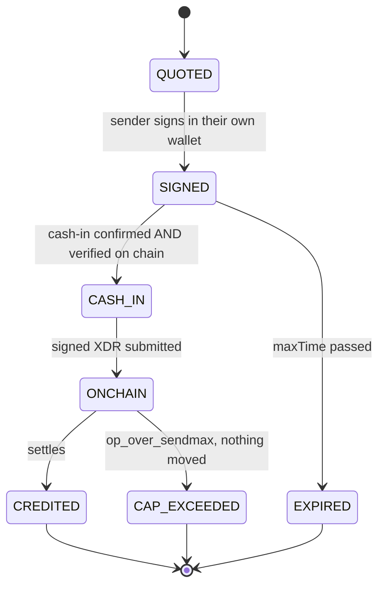

# Corra: Ledger (schema and state transition rules)

> The ledger records payment status; **the chain is the authority**. Where the two disagree, the chain wins and the reconciler advances the ledger to match. Postgres.

## 1. Tables

```sql
-- One payment = one saga. idempotency_key UNIQUE means the same request cannot create two payments.
CREATE TABLE payments (
  id                TEXT PRIMARY KEY,             -- pmt_...
  public_id         TEXT NOT NULL UNIQUE,         -- short id shown to the user
  idempotency_key   TEXT NOT NULL UNIQUE,         -- idempotency key of the confirm() call
  sender_account    TEXT NOT NULL,
  recipient_account TEXT NOT NULL,
  corridor_from     TEXT NOT NULL,                -- "MX/MXN"
  corridor_to       TEXT NOT NULL,                -- "PH/PHP"
  quote             JSONB NOT NULL,               -- frozen quote snapshot: anchor quote id + expiry, unchanged
  source_raw        NUMERIC(40,0) NOT NULL,       -- minor unit (bigint)
  dest_raw          NUMERIC(40,0) NOT NULL,
  send_max_raw      NUMERIC(40,0) NOT NULL,       -- the cap the sender signed
  signed_xdr        TEXT,                         -- the pre-signed transaction, NULL once submitted or expired
  max_time          TIMESTAMPTZ,                  -- timebound the sender signed (30 min)
  supersedes_id     TEXT REFERENCES payments(id), -- set when this saga replaces an EXPIRED/CAP_EXCEEDED one
  state             TEXT NOT NULL,                -- PaymentState
  created_at        TIMESTAMPTZ NOT NULL DEFAULT now(),
  updated_at        TIMESTAMPTZ NOT NULL DEFAULT now()
);

-- Legs: cash_in / onchain / cash_out. external_ref is the anchor side; idempotent dedupe.
CREATE TABLE legs (
  id            TEXT PRIMARY KEY,                 -- leg_...
  payment_id    TEXT NOT NULL REFERENCES payments(id),
  kind          TEXT NOT NULL,                    -- cash_in | onchain | cash_out
  anchor_id     TEXT,                             -- which anchor served this leg
  external_ref  TEXT,                             -- anchor leg reference (SEP-24 transaction id)
  tx_hash       TEXT,                             -- for the onchain leg
  amount_raw    NUMERIC(40,0) NOT NULL,
  asset_code    TEXT NOT NULL,
  asset_issuer  TEXT,
  status        TEXT NOT NULL DEFAULT 'PENDING',  -- LegStatus
  created_at    TIMESTAMPTZ NOT NULL DEFAULT now(),
  updated_at    TIMESTAMPTZ NOT NULL DEFAULT now(),
  UNIQUE (payment_id, kind),                      -- one of each leg per payment
  UNIQUE (anchor_id, external_ref)                -- the same anchor event is not processed twice
);

-- Append-only timeline. Never UPDATE/DELETE.
CREATE TABLE payment_events (
  id          BIGSERIAL PRIMARY KEY,
  payment_id  TEXT NOT NULL REFERENCES payments(id),
  seq         INT  NOT NULL,                      -- monotonic order within a payment
  type        TEXT NOT NULL,                      -- QUOTED, SIGNED, CASH_IN, ...
  from_state  TEXT,
  to_state    TEXT,
  data        JSONB,                              -- event payload (txHash, ref, error...)
  created_at  TIMESTAMPTZ NOT NULL DEFAULT now(),
  UNIQUE (payment_id, seq)                        -- do not write the same sequence twice (idempotent progress)
);
```

**What the ledger never stores.** No names, no phone numbers, no bank details, no identity documents, no KYC data. Customer identity stays with the anchor, which is the licensed party required to hold it. The only user-linked values here are Stellar account IDs, which are public by construction.

**`signed_xdr` is a blob, not a key.** It is a transaction the sender already signed, fully bound to a recipient, an amount and a cap. It is deleted on submission or expiry. Corra signs nothing with a user's key. The one server-side key it holds, the fee-and-sponsor account, signs only fee-bump envelopes (CAP-15) and `BeginSponsoringFutureReserves` (CAP-33) so the sender needs no XLM, and it can move no user value. A CI job named `no-server-side-signing` asserts that scoped invariant and prints the scope it checks; see the README for the four conditions it fails on.

## 2. Allowed state transitions

Five states plus two terminal exits. Any other transition is rejected (illegal transition guard).


```mermaid
stateDiagram-v2
    [*] --> QUOTED
    QUOTED --> SIGNED: sender signs in their own wallet
    SIGNED --> CASH_IN: cash-in confirmed AND verified on chain
    SIGNED --> EXPIRED: maxTime passed
    CASH_IN --> ONCHAIN: signed XDR submitted
    ONCHAIN --> CREDITED: settles
    ONCHAIN --> CAP_EXCEEDED: op_over_sendmax, nothing moved
    CREDITED --> [*]
    EXPIRED --> [*]
    CAP_EXCEEDED --> [*]
```

| from | allowed to |
|---|---|
| QUOTED | SIGNED |
| SIGNED | CASH_IN, EXPIRED |
| CASH_IN | ONCHAIN |
| ONCHAIN | CREDITED, CAP_EXCEEDED |
| CREDITED / EXPIRED / CAP_EXCEEDED | *(terminal)* |

**Terminal exits never loop back.** Re-signing does not revive an `EXPIRED` or `CAP_EXCEEDED` saga. It opens a **new** payment row whose `supersedes_id` points at the old one, so the ledger keeps exactly one row per signed transaction and the timeline of a retried payment stays readable.

**`CASH_IN` is not entered on the callback alone.** The anchor's SEP-24 callback is signed with the `SIGNING_KEY` published in its `stellar.toml`, and the signature and timestamp freshness are both checked. Even then the callback is only a trigger: before advancing, the orchestrator independently confirms from chain state that the deposit actually credited the sender's account. A forged, stale or replayed callback therefore cannot cause a submission.

**What `CAP_EXCEEDED` looks like on chain.** The transaction fails at the operation level with `op_over_sendmax`, so it lands in a ledger as a failed transaction. No path payment is applied and the sender keeps the deposited asset in an account only they can sign for, but the fee and the sequence number are consumed, so the signed blob is spent.

## 3. Progress protocol (idempotent)

Every state advance happens inside a **single transaction**:
1. Lock the payment with `SELECT ... FOR UPDATE` (prevents a concurrent callback + reconciler race).
2. Is the transition allowed? If not, no-op (for example, a late duplicate callback).
3. Update `payments.state` and update `legs`.
4. Insert `(payment_id, seq+1)` into `payment_events`. If `UNIQUE(payment_id, seq)` conflicts, it has already been processed, so rollback, no-op.
5. commit.

> A callback **and** the reconciler can deliver the same fact, so `UNIQUE(anchor_id, external_ref)` plus the event `seq` make repeated delivery harmless at the ledger level.

**Exactly-once submission is not ours to enforce, and we do not claim it.** The reconciler may retry submission any number of times; the effect is exactly-once because Stellar consumes the transaction's sequence number on the first successful submission and rejects every later resubmission of the same signed blob. That guarantee comes from the protocol, not from application logic.

## 4. Invariants (must hold after every commit)

- **Conservation of funds:** at `CREDITED`, the dest amount of the `onchain` leg equals `payments.dest_raw` (no tolerance; strict-receive fixes the destination amount).
- **The cap is never exceeded:** the source amount actually spent is never greater than `send_max_raw`, which is what the sender signed.
- **Single active leg:** only one leg is `PENDING` at a time (sequential saga, not parallel).
- **Terminal is immutable:** after `CREDITED`, `EXPIRED` or `CAP_EXCEEDED`, `payments.state` never changes. A retry is a new row, not a mutation.
- **Event monotonicity:** `payment_events.seq` increases with no gaps; the timeline is the audit log.
- **No user key in the schema:** no column holds a user's secret key, a seed, or anything from which one could be derived. `signed_xdr` is a signed artifact and is deleted on submission or expiry. The fee-and-sponsor key lives in the deployment's secret store, never in this database.
- **The chain outranks the ledger:** if the ledger says `ONCHAIN` and the chain says the transaction settled, the reconciler advances the ledger. The reconciler never makes a discretionary decision.

## 5. Reconciler

For payments that sit in `SIGNED`, `CASH_IN` or `ONCHAIN` longer than X seconds, the reconciler reads the authoritative fact and advances the saga to match:

- **onchain:** read the transaction from Horizon by hash, or the account's recent transactions when no hash was recorded.
- **cash_in:** read the SEP-24 transaction status through `@stellar/typescript-wallet-sdk`, and confirm the credit from chain state.

It runs over its own pending payments only. It indexes nothing, watches no account that did not start a payment through this instance, and holds no funds and no keys. This is the safety belt against a lost callback, and it is why a lost callback costs a delay rather than a stuck payment.

Context: [contracts](contracts.md) · [flows](flows.md)
